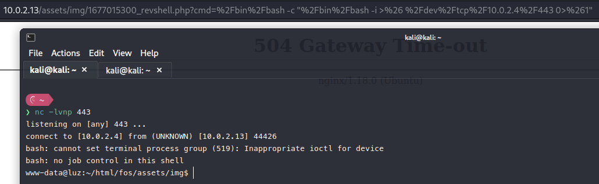
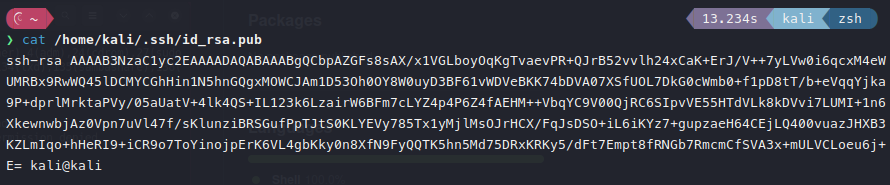
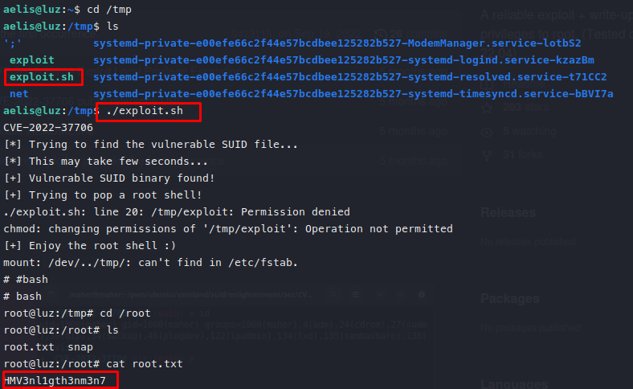

# Luz HackMyVM

- Ip atacante - 10.0.2.13
- Ip victima - 10.0.2.9
## Nmap

Realizamos el primer escaneo y solo tenemos dos puestos abiertos

   

## 80 http

Al parecer es una pagina muy normal y la verdad que pense que teniamos por el ?page=home algun tipo de LFI pero al parecer no es el caso.
Entonces cuando segui jugando con la nos encontramos con que al agregar 
o ver un producto carga en la seccion de network un link muy interesante


Ahora veremos si la pagina tiene SQLI. Para esto correremos sqlmap

```sqlmap -u http://10.0.2.13/view_prod.php?id=3```


Viendo la imagen podemos ver que esta usando MySQL y que puedo utilizar el tipo de Union para realizar el SQLI
Ahora ire a probarla a la web para ver cual es el campo injectable.


```sqlmap -u http://10.0.2.13/view_prod.php?id=1 --technique=U --dbms=mysql --dbs```


```sqlmap -u http://10.0.2.13/view_prod.php?id=1 --technique=U --dbms=mysql -D fos --tables```


```sqlmap -u http://10.0.2.13/view_prod.php?id=1 --technique=U --dbms=mysql -D fos -T user_info --dump --batch```


```sqlmap -u http://10.0.2.13/view_prod.php?id=1 --technique=U --dbms=mysql -D fos -T users --dump --batch```


Ok pero ahora esto no nos ayuda mucho debido a que es complicado pasar el hash del password a texto plano. 

Para esto vamos a continuar haciendo un scanning a la pagina de admin para ver que nos podemos encontrar.

```gobuster dir -w /usr/share/wordlists/dirbuster/directory-list-2.3-medium.txt -u http://10.0.2.13/admin -x .php,.html,.txt```


Dentro de users.php nos encontramos que hay una pagina muy interesante y dentro de su codigo fuente nos encontramos otra pagina la cual nos permite crear un nuevo usuario


Ahora ya dentro de la pagina de manage_user.php intentamos crear un nuevo usuario de tipo administrador


Al carecer de un boton en la pagina para darle a confirmar lo haremos desde el terminal con curl
Para esto leeremos el codigo fuente para saber el nombre los parametros y ver cual tiene que ser la respuesta.


En este caso vemos que la respuesta tiene que ser 1 si se ha creado correctamente el usuario.

```curl --url "http://10.0.2.13/admin/ajax.php?action=save_user" -X POST -d "name=test&username=test&password=test&type=1"```


Ahora con este comando deberia actualizar la tabla de usuarios y salir el test
```sqlmap -u http://10.0.2.13/view_prod.php?id=1 --technique=U --dbms=mysql -D fos -T users --dump --batch --flush-session```

Ahora si procedemos a ingresar a la pagina principal e ingresar como login de administradores.

Viendo la pagina vemos que tiene para subir un menu. Intente subir un menu totalmente normal y luego intente subir un .txt para ver si admite subir otro tipo de archivo.

Efectivamente si permite subir otro archivo, entonces intentaremos subir un archivo que nos proporcione inyectar codigo con php


Actualizamos el menu junto con el shell.php


Ahora solo debemos aprovecharnos del archivo que subimos


urlencodeamos un reverse shell y listo


Con esto ya tenemos nuestra shell siendo www-data
Solo queda buscar la forma de cambiar de usuario y escalar privilegios



Encontramos en la ruta /html el user.txt con la primera flag


Ahora hacemos un poco de enumeracion, pero no encontre nada interesante hasta que tire del comando find


Ahora buscamos el bsd y el csh en gtfobins y nos aparece que hacer
https://gtfobins.github.io/gtfobins/csh/
Yendo a la direccion de /usr/bin y corriendo el comando que nos proporcionan logro obtener una shell como aelis


Ahora no nos deja avanzar, sin embargo vamos a ingresar por el puerto 22 ssh

## 22 ssh

- En la maquina atacante (Generando mi clave publica)
```rm -rf ~/.ssh```
```ssh-keygen```



- En la maquina victima (Ingresando clave publica)

Ahora si podemos visualizar mi clave publica y pasarla dentro de **/home/aelis/.ssh/authorized_keys** en la maquina victima


Ahora solo queda conectarme como ```ssh aelis@10.0.2.13```
De esta manera ya no nos pide la contraseña de aelis pero si nos permite entrar como aelis.

Ahora si nos fijamos encontramos en el comando find de arriba un tal enlightement que basicamente es un gestionador de ventanas

Encontramos un exploit 
https://github.com/MaherAzzouzi/CVE-2022-37706-LPE-exploit

Lo copie y lo pegue en la ruta /tmp
Por ultimo lo corru y escalamos privilegios a root y obtuve la flag

