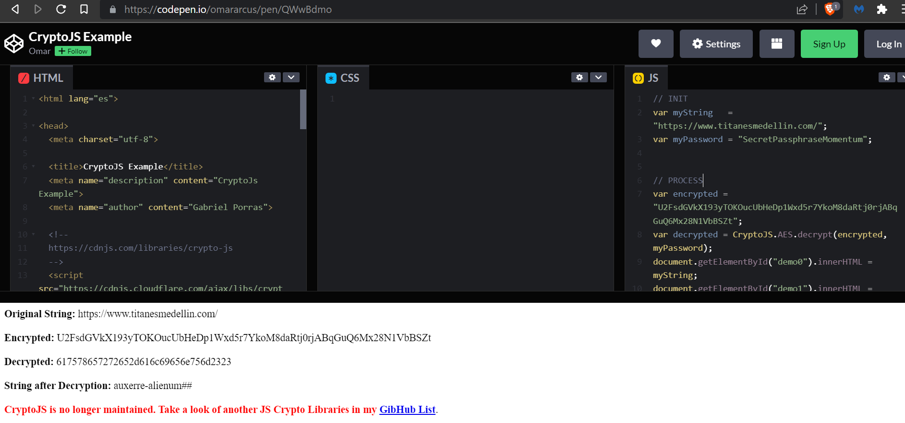

# Momentum VH

Hola antes de empezar con el writeup quería recordar que este es mi primer writeup. Lo hice hace unos meses y solo quería recordarlo debido a que quizá no es tan profesional como a mí me gustaría, pero pues estaba iniciando. Sin nada mas que decir empecemos.

- Ip atacante - 10.0.2.4
- Ip victima - 10.0.2.9

# Nmap

Realizamos un escaneo rápido por todos los puertos


Ahora lo único que nos llama la atención es el puerto con el servicio de http así que procederemos a entrar en él.

# 80 http


Nos encontramos con una página en la cual podemos darle click a las imágenes y puedo cambiar las imágenes alterando el link. No sé si esto nos pueda llevar a algo más.

También leí el código fuente de la página y nada. Ahorita lo único que se me ocurre es tirar del ffuf o gobuster buscando más directorios.


Encontramos un el js/main.js un "SecretPassphraseMomentum"


Al darle click a una imagen me abrió una nueva página con descripción de la imagen.
Si nos damos cuenta existe el id=demon.


Al parecer esta página puede tener la vulnerabilidad de XSS. Así que intentamos procedemos a extraer la cookie con esta vulnerabilidad


Cookie: U2FsdGVkX193yTOKOucUbHeDp1Wxd5r7YkoM8daRtj0rjABqGuQ6Mx28N1VbBSZt

Buscamos un descifrador online de cryptoJS y encontramos este. Cambiamos el password y la encryptacion.



Vemos que él descifrador nos arroja un auxerre-alienum## (usuario y contraseña)
User: auxerre
Password: auxerre-alienum##

# 22 ssh

User: auxerre
Password: auxerre-alienum##
Usamos ssh auxerre@10.0.2.9
Una vez dentro nos encontramos con el user flag.


Intentamos un sudo -l pero no nos permite


Ahora investigare un poco más la pc y luego intentare el comando -\> find / -perm
Investigando puedo darme cuenta que el único usuario en la pc es auxerre
Ahora sí, el comando find


No hay nada critico así que no nos interesa
Con el comando -\> ```ps -faux```
Vemos los procesos y vemos un proceso llamado redis-server


Vemos si está abierto y en escucha el puerto de redis con el comando de --\> ss-nltup


Ingresamos a la página de hacktricks y buscamos el puerto de redis

- [https://book.hacktricks.xyz/welcome/readme](https://book.hacktricks.xyz/welcome/readme)
- [https://book.hacktricks.xyz/network-services-pentesting/6379-pentesting-redis](https://book.hacktricks.xyz/network-services-pentesting/6379-pentesting-redis)


Con ayuda de hacktricks entramos y obtenemos lo que parece ser la contraseña del usuario root
Cambiamos de usuario con ```su root```
Ingresamos la contraseña proporcionada y obtenemos la flag de root.

